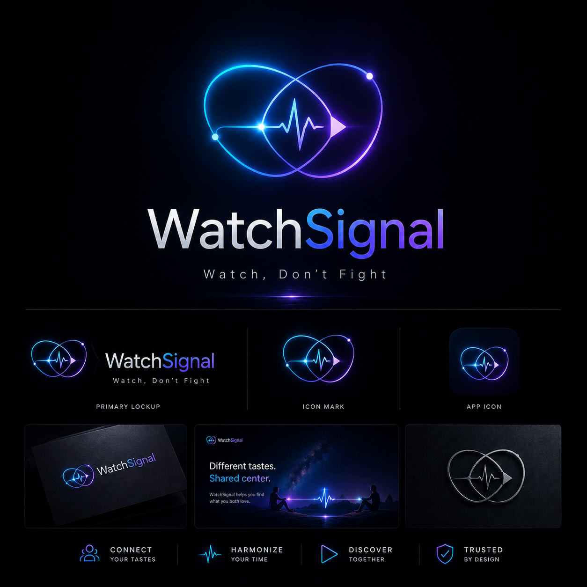
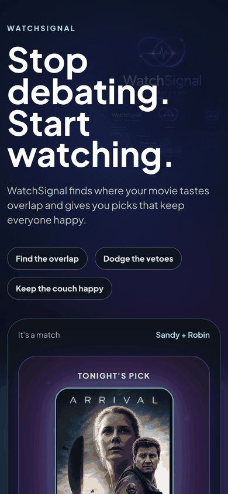
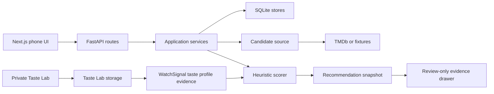

# WatchSignal

<p align="center">
  
</p>

<p align="center">
  <strong>Phone-first movie-night mediation for couples who want less couch debate and better shared picks.</strong>
</p>

<p align="center">
  
</p>

<p align="center">
  <em>Demo screens use movie metadata and poster imagery through the local app flow.
  Private credentials, generated local datasets, and personal taste data are not committed.</em>
</p>

WatchSignal is a code-first prototype for shared movie selection.
It turns a fuzzy two-person decision into an inspectable workflow: set up each person, pass the phone, collect private reactions, combine those reactions with recommendation evidence, and explain why a pick won.

The current product bet is simple: a good movie-night recommender should not only rank movies.
It should mediate taste overlap, avoid obvious deal-breakers, and show enough evidence that the final pick feels fair.

Start here if you want the project story:

- [MVP decision summary](docs/architecture/mvp-decision-summary.md)
- [Code-first app architecture](docs/architecture/code-first-app-architecture.md)
- [Taste Lab PRD](docs/prd-taste-lab.md)
- [Taste Lab issue breakdown](docs/issues/taste-lab-issue-breakdown.md)
- [Live usable MVP gate](docs/validation/live-usable-mvp-gate-2026-06-30.md)

## What The Demo Shows

- Phone-first setup for household profiles and defaults.
- Pass-the-phone reactions where each person responds to the same shortlist privately.
- Shared ranking that combines both people instead of optimizing for only one person.
- Debug and evidence surfaces for session state, scoring snapshots, and Taste Lab profile signals.
- Private Taste Lab calibration that can update WatchSignal taste evidence without becoming part of the normal couch flow.
- Showcase pages for portfolio review without replacing the working app route.

## What It Does Today

- Runs a Next.js app router frontend and FastAPI backend locally.
- Persists setup, onboarding, shared sessions, reactions, outcomes, feedback, snapshots, backfill, and Taste Lab ratings in SQLite.
- Fetches live candidates from TMDb when configured, with fixture fallback for deterministic local review.
- Scores shared recommendations with mode-aware compromise, husband-first, and wife-first behavior.
- Applies safety and watchability gates such as already-watched filtering, provider constraints, media type constraints, horror exclusion, and safe-pick ranking.
- Records recommendation snapshots so a session can be inspected after the fact.
- Lets a private Taste Lab route collect fast movie ratings from a generated MovieLens-derived queue.
- Converts saved Taste Lab ratings into WatchSignal profile evidence.
- Lets recommendation scoring consume Taste Lab evidence and explain when it influenced a pick.
- Runs a fixed Taste Lab evaluation command that compares no Taste Lab data, weak seeded data, and high-signal Taste Lab data.

## Why It Exists

Movie-night choice is rarely just a catalog-search problem.
The hard part is the social decision: two people have partial memory, soft constraints, mood, streaming availability, and different veto thresholds.

WatchSignal explores a narrower product bet:

- keep each person's taste separate until the recommendation layer combines it,
- make compromise explicit rather than hiding it behind one opaque score,
- treat calibration data as durable evidence, not as a separate toy,
- show why a recommendation won,
- keep local prototype state inspectable so the product can be debugged without workflow black boxes.

## Architecture Choices

WatchSignal is built as an inspectable app stack, not as a hidden automation workflow.



Key choices:

- **Explicit service boundaries:** setup, onboarding, sessions, feedback, snapshots, backfill, shortlist generation, and Taste Lab each have bounded application services or storage adapters.
- **Recommendation logic stays code-first:** scoring lives in Python domain and scoring modules, separate from transport, UI, and persistence.
- **Transport is replaceable:** local mobile web is the MVP surface, while Telegram or other adapters can be later transport layers.
- **Taste Lab is additive evidence:** Taste Lab ratings enrich `UserProfile` taste evidence without replacing onboarding, reactions, feedback, or watched-history signals.
- **Private calibration before public productization:** Taste Lab is accessible locally, but it is not advertised as a required public app feature.
- **Snapshots make behavior inspectable:** debug history can show the candidate inputs, ranking, scores, hard-filter decisions, and Taste Lab influence line.
- **Generated data stays local:** the MovieLens-derived queue artifact is ignored by Git because its source dataset and license handling belong outside the committed repo.

## Current vs Roadmap

| Area | Current | Roadmap |
| --- | --- | --- |
| Couch flow | Local mobile web pass-the-phone flow with backend-backed sessions | More polished everyday UX, better recovery, and household-level history views |
| Candidate source | TMDb live path plus deterministic fixtures | Better provider-aware candidate generation and richer quality filters |
| Scoring | Inspectable heuristic scorer with compromise modes and Taste Lab genre evidence | Stronger personalization using title similarity, tags, session feedback, and evaluation metrics |
| Taste Lab | Private calibration route, generated high-signal queue, profile evidence read model, scoring integration | Adaptive calibration, better queue strategy, and an optional mature in-app surface |
| Evidence | Review-only session evidence drawer and fixed evaluation report | Founder-facing evaluation dashboard and richer score explanations |
| Portfolio | Showcase routes and demo GIFs | A sharper recruiter story showing calibration-to-recommendation payoff |

## Taste Lab MVP Plus 1

Taste Lab started as research infrastructure for rapid taste calibration.
The MVP plus 1 outcome is now implemented: a user can rate movies in Taste Lab and have those ratings update WatchSignal taste evidence.

The important path is:

1. Generate or seed a high-signal movie queue.
2. Rate movies in the private Taste Lab route.
3. Persist ratings with label, familiarity, profile id, movie identity, provenance, and timestamp.
4. Expose a WatchSignal taste-profile summary.
5. Attach that evidence to the active recommendation profiles.
6. Let the scorer use it.
7. Show `Taste Lab signals` in recommendation explanations.
8. Verify the behavior with `scripts/taste_lab_evaluation.py`.

The fixed evaluation currently shows the high-signal Taste Lab strategy moving the target shared-fit movie from rank 3 to rank 1.
That is not a claim that the recommender is mature.
It is proof that the data path is real and measurable.

## Safety And Privacy Boundaries

- This repo does not commit secrets, local databases, downloaded MovieLens data, or generated MovieLens-derived queue artifacts.
- Taste Lab is private and optional.
- `Haven't seen` is modeled as familiarity-only evidence, not negative taste.
- Taste Lab evidence is profile-specific, so one person's calibration does not silently become the household's taste.
- The review-only evidence drawer is for local inspection, not a public consumer surface.
- TMDb credentials belong in local environment variables.
- The project does not claim production-grade recommendation quality, auth, deployment hardening, or content-safety guarantees yet.

## Proof Points For Reviewers

- Product demo: [docs/assets/watchsignal-showcase.gif](docs/assets/watchsignal-showcase.gif)
- Pass-the-phone flow demo: [docs/assets/watchsignal-flow.gif](docs/assets/watchsignal-flow.gif)
- Code-first architecture: [docs/architecture/code-first-app-architecture.md](docs/architecture/code-first-app-architecture.md)
- Shared session state machine: [docs/architecture/shared-session-state-machine.md](docs/architecture/shared-session-state-machine.md)
- Mode-aware scoring: [docs/architecture/mode-aware-shared-scoring.md](docs/architecture/mode-aware-shared-scoring.md)
- History and debug visibility: [docs/architecture/history-debug-visibility.md](docs/architecture/history-debug-visibility.md)
- Taste Lab research brief: [docs/taste-lab-research-brief.md](docs/taste-lab-research-brief.md)
- Taste Lab generated queue setup: [docs/setup/taste-lab-generated-seed-queue.md](docs/setup/taste-lab-generated-seed-queue.md)
- Taste Lab evaluation setup: [docs/setup/taste-lab-evaluation.md](docs/setup/taste-lab-evaluation.md)
- MVP gate validation: [docs/validation/live-usable-mvp-gate-2026-06-30.md](docs/validation/live-usable-mvp-gate-2026-06-30.md)

## Repo Guide

- `apps/web/`: Next.js app router frontend, API proxy routes, pass-the-phone UI, showcase routes, and Taste Lab UI.
- `apps/api/src/movie_night_mediator/api/`: FastAPI route layer and payload contracts.
- `apps/api/src/movie_night_mediator/app/`: application services for setup, onboarding, sessions, shortlist generation, feedback, history, backfill, and snapshots.
- `apps/api/src/movie_night_mediator/domain/`: domain models and service protocols.
- `apps/api/src/movie_night_mediator/scoring/`: recommendation scoring logic.
- `apps/api/src/movie_night_mediator/storage/`: SQLite and in-memory storage adapters.
- `apps/api/src/movie_night_mediator/taste_lab/`: Taste Lab contracts, queue generation, storage service, profile read model, and evaluation.
- `apps/api/tests/`: API, domain, storage, scoring, Taste Lab, and integration-style unit tests.
- `scripts/`: runnable utility commands, including Taste Lab signal scoring and evaluation.
- `docs/`: PRDs, architecture notes, issue breakdowns, validation records, setup guides, and portfolio notes.

## Running It Locally

Install dependencies with the repository package manager.
The workspace records allowed dependency build scripts in `pnpm-workspace.yaml`.

```sh
pnpm install
```

Run the FastAPI backend from one terminal:

```sh
cd apps/api
../../.tools/uv/bin/uv run uvicorn movie_night_mediator.api.main:app --reload --host 0.0.0.0 --port 8000
```

Run the Next.js web app from another terminal:

```sh
pnpm dev:web
```

Open the working app:

```text
http://localhost:3000
```

Open the private Taste Lab route:

```text
http://localhost:3000/taste-lab
```

Open the portfolio showcase:

```text
http://localhost:3000/showcase
```

Open the staged flow demo:

```text
http://localhost:3000/showcase/flow
```

## Taste Lab Commands

Run the fixed Taste Lab evaluation:

```sh
python3 scripts/taste_lab_evaluation.py
```

Generate a local MovieLens-derived Taste Lab queue after preparing the local dataset paths documented in setup notes:

```sh
python3 scripts/taste_lab_generate_seed_queue.py
```

Run the signal-score fixture command:

```sh
python3 scripts/taste_lab_signal_score.py \
  --movies apps/api/tests/fixtures/taste_lab/movies.csv \
  --ratings apps/api/tests/fixtures/taste_lab/ratings.csv \
  --limit 10
```

## Validation

Run the main project gate:

```sh
pnpm check
```

Run the production web build:

```sh
pnpm build:web
```

Run backend tests directly:

```sh
cd apps/api
../../.tools/uv/bin/uv run python -m unittest discover -s tests
../../.tools/uv/bin/uv run python -m compileall -q src tests
```

Run the web TypeScript check directly:

```sh
apps/web/node_modules/.bin/tsc -p apps/web/tsconfig.json --noEmit
```

## Private Local Data

These paths are local-only and should not be committed:

- `.env`
- `.env.*`
- `*.sqlite3`
- `apps/api/data/taste_lab_seed_queue.generated.json`
- downloaded MovieLens datasets
- local TMDb credentials

## Current Status

The local MVP is functional and the Taste Lab MVP plus 1 outcome is implemented.
The strongest next product lane is recommendation quality beyond genre-level evidence: title similarity, tag dimensions, feedback learning, and a better evaluation harness.
The strongest next portfolio lane is a clearer public story showing calibration in Taste Lab changing WatchSignal's final pick.
