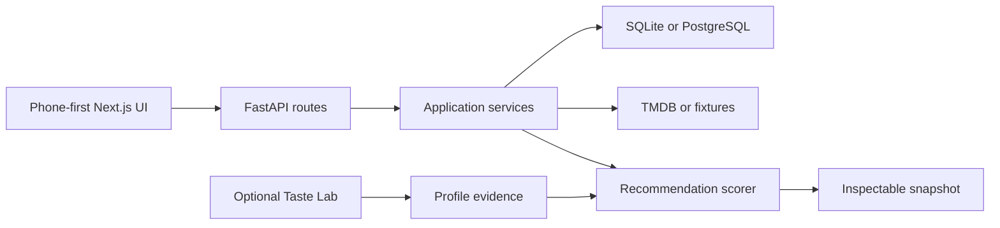

# WatchSignal

<p align="center">
  
</p>

<p align="center">
  <strong>A phone-first movie picker that helps two people find the shared yes.</strong>
</p>

<p align="center">
  <a href="https://watchsignal-web.vercel.app/showcase"><strong>View the product showcase</strong></a>
  ·
  <a href="docs/recommendation-evaluation.md">Read the evaluation</a>
  ·
  <a href="docs/architecture/code-first-app-architecture.md">Explore the architecture</a>
</p>

<p align="center">
  
</p>

WatchSignal tackles a familiar but surprisingly social problem: two people want to watch a movie, but neither wants to spend the evening negotiating the shortlist.
Each person reacts privately to the same set of options, then WatchSignal combines those signals, respects hard no votes, and explains why one title is the strongest shared pick.

The product is a working prototype, not a landing-page mockup.
It includes a phone-first Next.js interface, a FastAPI service, persistent household sessions, an inspectable recommendation engine, and an offline evaluation program that can reject a model when the evidence is not strong enough.

## The Product Flow

1. Two people set their mood, constraints, and viewing preferences.
2. They pass the phone and react to the same shortlist independently.
3. WatchSignal filters deal-breakers and ranks the remaining overlap.
4. The result explains the strongest shared signal instead of presenting an unexplained score.
5. Feedback and optional Taste Lab ratings become evidence for later recommendations.

The public showcase uses synthetic profiles and a fixed product story.
The signed-in household app, private taste calibration, and personal viewing data stay behind household access controls.

## What Is Working

- A responsive pass-the-phone flow for setup, private reactions, and a shared result.
- Compromise, person-first, and safe-pick recommendation modes.
- Filtering for watched titles, provider availability, media type, horror exclusions, and other hard constraints.
- SQLite persistence for profiles, sessions, reactions, outcomes, feedback, watchlists, and recommendation snapshots.
- A live TMDB candidate source with a deterministic fixture fallback.
- An optional Taste Lab that turns fast movie ratings into profile-specific recommendation evidence.
- A review surface that shows the inputs, filters, scores, and signals behind a result.
- A repeatable MovieLens evaluation ladder covering heuristics, popularity, collaborative filtering, and hybrid approaches.

## Recommendation Work

WatchSignal treats recommendation quality as a product decision, not a model demo.
Every candidate has to earn its place through a chronological evaluation protocol, safety checks, and an explicit usefulness threshold.

The latest offline round selected a compact collaborative model over the more complex hybrid through the protocol's simplicity route.
It was effectively tied on ranking quality, while reducing artifact size by 78.6%, measured fit time by 43.5%, and same-loop scoring time by 35.5%.
That result makes it the current offline individual-taste champion.
It does not make it the household default.

Historical ratings cannot fully represent tonight's mood, streaming availability, or the dynamics of compromise between two people.
The heuristic V2 path therefore remains the reversible product default until household evidence supports a change.
This separation between offline performance and product promotion is intentional.

Read the [evaluation narrative](docs/recommendation-evaluation.md), [locked benchmark protocol](docs/validation/movielens-benchmark-protocol.md), or [product integration decision](docs/validation/learned-taste-product-integration.md) for the full evidence trail.

## Run The Demo With Docker

The Docker demo is the shortest path from a fresh checkout to a working product.
It starts the web app, FastAPI service, deterministic recommendation fixtures, and a persistent local SQLite volume without requiring API keys.

```bash
docker compose up --build
```

Open [http://localhost:3000/showcase](http://localhost:3000/showcase) for the product story or [http://localhost:3000](http://localhost:3000) for the working household flow.
The API health check is available at [http://localhost:8000/health](http://localhost:8000/health).

When you are finished:

```bash
docker compose down
```

Run `docker compose down --volumes` if you also want to remove the demo database.

## Run It Natively

You will need Node.js 22.6 or newer, pnpm 10, Python 3.11 or newer, and [uv](https://docs.astral.sh/uv/).

```bash
pnpm install
pnpm dev:web
```

In a second terminal:

```bash
cd apps/api
uv run uvicorn movie_night_mediator.api.main:app --reload
```

The default development path uses deterministic candidates and local SQLite storage.
Copy `.env.example` to `.env` only when you want to configure optional live services such as TMDB.

## Architecture



The code keeps recommendation logic separate from the interface, transport, and persistence layers.
That makes the scoring behavior testable without a browser and lets the product change its delivery surface without rebuilding its decision logic.
Recommendation snapshots preserve the inputs and decisions needed to explain a result after the session ends.

The project can use PostgreSQL for hosted deployments, but SQLite remains the deliberately boring default for local review.
The Docker path follows the same boundary and does not introduce a production dependency simply to make the project look more complex.

## Validation

```bash
pnpm check
pnpm build:web
```

The main check runs tooling tests, the Python suite, compile checks, and web state tests.
Continuous integration also builds both demo containers and verifies the public showcase and API health endpoint.

The repository keeps larger MovieLens source files and generated user-level artifacts out of Git.
Committed checksums and protocols make the experiments reproducible without publishing raw ratings or private household data.
The [public data policy](docs/public-data-policy.md) documents those boundaries, and CI checks common leak patterns on every change.

## Product And Engineering Notes

- [MVP decision summary](docs/architecture/mvp-decision-summary.md)
- [Code-first architecture](docs/architecture/code-first-app-architecture.md)
- [Shared session state machine](docs/architecture/shared-session-state-machine.md)
- [Mode-aware shared scoring](docs/architecture/mode-aware-shared-scoring.md)
- [Recommendation evaluation](docs/recommendation-evaluation.md)
- [Taste Lab research brief](docs/taste-lab-research-brief.md)
- [Beta readiness runbook](docs/beta-readiness/fresh-checkout-runbook.md)

## Data Attribution

Live movie metadata and poster images come from [The Movie Database](https://www.themoviedb.org).
This product uses the TMDB API but is not endorsed or certified by TMDB.
The app includes the required TMDB attribution on its public credits page.

## Status

WatchSignal is an actively developed prototype.
The public showcase is safe to explore without signing in, while the real household route remains online and protected.
The clearest next product proof is real household usage over repeated movie nights, especially whether better offline ranking produces decisions that both people trust.
