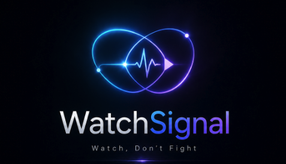
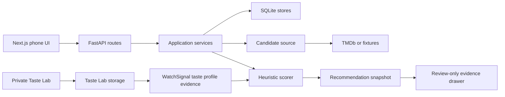

# WatchSignal

<p align="center">
  
</p>

<p align="center">
  <strong>Phone-first movie-night mediation for couples who want less couch debate and better shared picks.</strong>
</p>

<p align="center">
  
</p>

<p align="center">
  <em>Demo screens use movie metadata and poster imagery through the local app flow.
  Private credentials, generated local datasets, and personal taste data are not committed.</em>
</p>

WatchSignal is a code-first prototype for shared movie selection.
It turns a fuzzy two-person decision into an inspectable workflow: set up each person, pass the phone, collect private reactions, combine those reactions with recommendation evidence, and explain why a pick won.

The current product bet is simple: a good movie-night recommender should not only rank movies.
It should mediate taste overlap, avoid obvious deal-breakers, and show enough evidence that the final pick feels fair.

Start here if you want the project story:

- [MVP decision summary](docs/architecture/mvp-decision-summary.md)
- [Code-first app architecture](docs/architecture/code-first-app-architecture.md)
- [Recommendation evaluation](docs/recommendation-evaluation.md)
- [Taste Lab PRD](docs/prd-taste-lab.md)
- [Taste Lab issue breakdown](docs/issues/taste-lab-issue-breakdown.md)
- [MVP Plus 2 PRD](docs/prd-mvp-plus-2.md)
- [MVP Plus 2 issue breakdown](docs/issues/mvp-plus-2-issue-breakdown.md)
- [MVP Plus 3 PRD](docs/prd-mvp-plus-3.md)
- [MVP Plus 3 issue breakdown](docs/issues/mvp-plus-3-issue-breakdown.md)
- [Beta Readiness runbook](docs/beta-readiness/fresh-checkout-runbook.md)
- [Live usable MVP gate](docs/validation/live-usable-mvp-gate-2026-06-30.md)

## What The Demo Shows

- Phone-first setup for household profiles and defaults.
- Pass-the-phone reactions where each person responds to the same shortlist privately.
- Shared ranking that combines both people instead of optimizing for only one person.
- Debug and evidence surfaces for session state, scoring snapshots, and Taste Lab profile signals.
- Private Taste Lab calibration that can update WatchSignal taste evidence without becoming part of the normal couch flow.
- Showcase pages for portfolio review without replacing the working app route.

## What It Does Today

- Runs a Next.js app router frontend and FastAPI backend locally.
- Persists setup, onboarding, shared sessions, reactions, outcomes, feedback, snapshots, backfill, and Taste Lab ratings in SQLite.
- Fetches live candidates from TMDb when configured, with fixture fallback for deterministic local review.
- Scores shared recommendations with mode-aware compromise, husband-first, and wife-first behavior.
- Applies safety and watchability gates such as already-watched filtering, provider constraints, media type constraints, horror exclusion, and safe-pick ranking.
- Records recommendation snapshots so a session can be inspected after the fact.
- Lets a private Taste Lab route collect fast movie ratings from a generated MovieLens-derived queue.
- Converts saved Taste Lab ratings into WatchSignal profile evidence.
- Lets recommendation scoring consume Taste Lab evidence and explain when it influenced a pick.
- Runs a fixed Taste Lab evaluation command that compares no Taste Lab data, weak seeded data, and high-signal Taste Lab data.

## Why It Exists

Movie-night choice is rarely just a catalog-search problem.
The hard part is the social decision: two people have partial memory, soft constraints, mood, streaming availability, and different veto thresholds.

WatchSignal explores a narrower product bet:

- keep each person's taste separate until the recommendation layer combines it,
- make compromise explicit rather than hiding it behind one opaque score,
- treat calibration data as durable evidence, not as a separate toy,
- show why a recommendation won,
- keep local prototype state inspectable so the product can be debugged without workflow black boxes.

## Architecture Choices

WatchSignal is built as an inspectable app stack, not as a hidden automation workflow.



Key choices:

- **Explicit service boundaries:** setup, onboarding, sessions, feedback, snapshots, backfill, shortlist generation, and Taste Lab each have bounded application services or storage adapters.
- **Recommendation logic stays code-first:** scoring lives in Python domain and scoring modules, separate from transport, UI, and persistence.
- **Transport is replaceable:** local mobile web is the MVP surface, while Telegram or other adapters can be later transport layers.
- **Taste Lab is additive evidence:** Taste Lab ratings enrich `UserProfile` taste evidence without replacing onboarding, reactions, feedback, or watched-history signals.
- **Private calibration before public productization:** Taste Lab is accessible locally, but it is not advertised as a required public app feature.
- **Snapshots make behavior inspectable:** debug history can show the candidate inputs, ranking, scores, hard-filter decisions, and Taste Lab influence line.
- **Generated data stays local:** the MovieLens-derived queue artifact is ignored by Git because its source dataset and license handling belong outside the committed repo.

## Current vs Roadmap

| Area | Current | Roadmap |
| --- | --- | --- |
| Couch flow | Local mobile web pass-the-phone flow with backend-backed sessions | More polished everyday UX, better recovery, and household-level history views |
| Candidate source | TMDb live path plus deterministic fixtures | Better provider-aware candidate generation and richer quality filters |
| Scoring | Inspectable heuristic scorer with compromise modes and Taste Lab genre evidence | Stronger personalization using title similarity, tags, session feedback, and evaluation metrics |
| Taste Lab | Private calibration route, generated high-signal queue, profile evidence read model, scoring integration | Adaptive calibration, better queue strategy, and an optional mature in-app surface |
| Evidence | Review-only session evidence drawer and fixed evaluation report | Founder-facing evaluation dashboard and richer score explanations |
| Portfolio | Showcase routes and demo GIFs | A sharper recruiter story showing calibration-to-recommendation payoff |

## Taste Lab MVP Plus 1

Taste Lab started as research infrastructure for rapid taste calibration.
The MVP plus 1 outcome is now implemented: a user can rate movies in Taste Lab and have those ratings update WatchSignal taste evidence.

The important path is:

1. Generate or seed a high-signal movie queue.
2. Rate movies in the private Taste Lab route.
3. Persist ratings with label, familiarity, profile id, movie identity, provenance, and timestamp.
4. Expose a WatchSignal taste-profile summary.
5. Attach that evidence to the active recommendation profiles.
6. Let the scorer use it.
7. Show `Taste Lab signals` in recommendation explanations.
8. Verify the behavior with `scripts/taste_lab_evaluation.py`.

The fixed evaluation currently shows the high-signal Taste Lab strategy moving the target shared-fit movie from rank 3 to rank 1.
That is not a claim that the recommender is mature.
It is proof that the data path is real and measurable.

## Recommendation Evaluation

WatchSignal treats recommendation improvement as an evidence problem rather than a model-demo problem.
The Recommendation Learning Lab uses MovieLens 32M to compare popularity, V1, V2, collaborative, and hybrid approaches under chronological holdouts and protected exploration, validation, and sealed roles.

The current protocol covers 14,617 analysis-ready established users and locks NDCG@5, pairwise preference accuracy, a known-dislike safety guardrail, per-user confidence intervals, and a two-point minimum useful improvement before model training begins.
MovieLens-derived manifests remain local, while committed checksums make the benchmark reproducible without publishing raw user identifiers or future labels.

The first one-user tracer proves that V1 and V2 can receive byte-equivalent inputs before hidden future ratings are revealed to a separate evaluator.
The first cohort-scale result covers 14,077 protected exploration and validation evaluations.
It shows that popularity is a much stronger MovieLens baseline than either heuristic and that V2 does not yet beat V1, giving the learned-model work an honest bar rather than a predetermined success story.
The first ratings-only collaborative model clears that bar for deep-history validation users, but not yet for sparse or broadly established users.
Its deterministic artifact stores movie factors without storing user histories, and new users are folded in from only their earlier ratings.
The first fixed-snapshot hybrid adds genre, release-era, and pre-cutoff tag features without live metadata calls.
Its overall gain is small, but its strongest evidence is a repeatable sparse-item improvement for deep-history users.
Controlled ablations retain all three available content families and freeze one reproducible full-hybrid checksum before the sealed benchmark.
The sealed benchmark recommends **hold** rather than promotion: the selected hybrid beats the strongest comparator by 0.56 NDCG@5 points with a confidence interval above zero, but misses the predeclared two-point minimum useful improvement.
That is the point of the gate: it can say "real, but not yet worth changing the product default."
The founder decision is to promote the hybrid to reversible product integration because it beats the current V2 heuristic by 16.00 NDCG@5 points and achieves the highest sealed score, while retaining the household gate before any default change.
The original hybrid-versus-collaborative practical-effect gate remains failed; a [dated decision addendum](docs/validation/movielens-founder-decision-addendum.md) records the separate product rationale without rewriting the protocol.
The reversible learned-taste integration and household gate are documented in [the product integration packet](docs/validation/learned-taste-product-integration.md); V2 remains the default, and the gate is blocked until both active profiles meet the 10-rating cold-start minimum.
The completed second discovery round follows a [two-gate model-improvement protocol](docs/validation/model-improvement-development-protocol.md): learned candidates must materially beat V2, then earn preference over hybrid through quality or defensible simplicity.
The round searched 12 predeclared collaborative and ranking-aligned configurations, tuned hybrid support behavior, and selected a 16-dimension collaborative model with regularization `2.0` before opening the shared internal test.
Preference-weighted candidates did not win, and that negative result remains visible rather than being discarded.

The evaluated ladder contains five distinct approaches rather than three versions of one model.
V1 and V2 are hand-authored product heuristics, popularity is a non-personalized control, collaborative is a ratings-only model trained from scratch without V1 or V2, and hybrid adds content evidence to that collaborative model without using V1 or V2.
V1 narrowly beats V2 on validation-established users, while sealed-established results reverse by a negligible amount, so the defensible conclusion is that V2 has not established an improvement over V1 and both trail the learned models substantially.

The shared 2,924-user internal test found the collaborative challenger and support-aware hybrid practically tied on NDCG@5 while the challenger was smaller, faster, and independent of the content snapshot.
The challenger therefore passed the predeclared simplicity route rather than the 0.02 quality route.

A checksum-locked replacement panel then used 5,000 previously unused MovieLens users with the same 100-history and 30-future task but a disjoint 30-to-364-day activity-span contract.
On that one-time panel, collaborative scored `0.615832` NDCG@5, hybrid scored `0.615439`, and V2 scored `0.437816`.
Collaborative minus hybrid was `+0.000393`, with a paired 95% interval from `-0.001928` to `0.002588`, safely inside the locked `-0.005` non-inferiority margin.
Collaborative also improved pairwise accuracy, slightly reduced known-dislike exposure, retained `0.997120` coverage, reduced artifact size by `78.6%`, reduced measured fit time by `43.5%`, and reduced same-loop scoring time by `35.5%`.
The replacement benchmark therefore promotes the regularization-2.0 collaborative model as the **offline individual-taste champion** through the simplicity route.
Its checksum is `d6858942711fe929858c9143c8ca419952be9f135addd3f9b9694ac2294a344b`, and the reversible `v2_collaborative` adapter now targets that exact artifact.

The replacement panel is independent at the user level but remains part of MovieLens 32M, so this is not cross-dataset replication.
The panel is now spent, and any model revision informed by its results requires fresh independent evidence.
This is deliberately an offline quality gate, not a claim of complete product success.
Any winning model must still pass household review because historical individual ratings cannot represent couple compromise, tonight intent, streaming availability, or user trust.
Sophie now has enough saved Taste Lab evidence for a future first household calibration pass, but real couple-mode validation is deferred until actual app use next week.
The current status is recorded in [Sophie household validation status](docs/validation/sophie-household-validation-status-2026-07-12.md).
V2 remains the product default until a separate household decision changes it.
The next offline research lane is [Recommendation Model Discovery Phase 2](docs/issues/recommendation-model-discovery-phase-2-issue-breakdown.md), which keeps household validation separate from MovieLens model discovery.
That phase completed locally with a hold decision: the collaborative regularization-2.0 model remains the offline individual-taste champion, no fresh evidence panel was spent, and the next model-research step should be a separate fixed-source metadata snapshot before testing cast, crew, language, keyword, runtime, or production features.

Read the [evaluation narrative](docs/recommendation-evaluation.md) or the [locked benchmark protocol](docs/validation/movielens-benchmark-protocol.md).

## Safety And Privacy Boundaries

- This repo does not commit secrets, local databases, downloaded MovieLens data, or generated MovieLens-derived queue artifacts.
- Taste Lab is private and optional.
- `Haven't seen` is modeled as familiarity-only evidence, not negative taste.
- Taste Lab evidence is profile-specific, so one person's calibration does not silently become the household's taste.
- The review-only evidence drawer is for local inspection, not a public consumer surface.
- TMDb credentials belong in local environment variables.
- The project does not claim production-grade recommendation quality, auth, deployment hardening, or content-safety guarantees yet.

## Proof Points For Reviewers

- Product demo: [docs/assets/watchsignal-showcase.gif](docs/assets/watchsignal-showcase.gif)
- Pass-the-phone flow demo: [docs/assets/watchsignal-flow.gif](docs/assets/watchsignal-flow.gif)
- Code-first architecture: [docs/architecture/code-first-app-architecture.md](docs/architecture/code-first-app-architecture.md)
- Shared session state machine: [docs/architecture/shared-session-state-machine.md](docs/architecture/shared-session-state-machine.md)
- Mode-aware scoring: [docs/architecture/mode-aware-shared-scoring.md](docs/architecture/mode-aware-shared-scoring.md)
- History and debug visibility: [docs/architecture/history-debug-visibility.md](docs/architecture/history-debug-visibility.md)
- Taste signal scale contract: [docs/architecture/taste-signal-scale-contract.md](docs/architecture/taste-signal-scale-contract.md)
- Taste Lab research brief: [docs/taste-lab-research-brief.md](docs/taste-lab-research-brief.md)
- Taste Lab generated queue setup: [docs/setup/taste-lab-generated-seed-queue.md](docs/setup/taste-lab-generated-seed-queue.md)
- Taste Lab evaluation setup: [docs/setup/taste-lab-evaluation.md](docs/setup/taste-lab-evaluation.md)
- Recommendation evaluation: [docs/recommendation-evaluation.md](docs/recommendation-evaluation.md)
- Locked MovieLens benchmark protocol: [docs/validation/movielens-benchmark-protocol.md](docs/validation/movielens-benchmark-protocol.md)
- One-user chronological tracer: [docs/validation/movielens-one-user-trace.md](docs/validation/movielens-one-user-trace.md)
- MovieLens cohort baselines: [docs/validation/movielens-cohort-baselines.md](docs/validation/movielens-cohort-baselines.md)
- Ratings-only collaborative baseline: [docs/validation/movielens-collaborative-baseline.md](docs/validation/movielens-collaborative-baseline.md)
- Content-collaborative hybrid: [docs/validation/movielens-hybrid-baseline.md](docs/validation/movielens-hybrid-baseline.md)
- Feature ablation and model selection: [docs/validation/movielens-model-selection.md](docs/validation/movielens-model-selection.md)
- Sealed benchmark decision packet: [docs/validation/movielens-sealed-benchmark.md](docs/validation/movielens-sealed-benchmark.md)
- Learned taste product integration: [docs/validation/learned-taste-product-integration.md](docs/validation/learned-taste-product-integration.md)
- Model improvement development protocol: [docs/validation/model-improvement-development-protocol.md](docs/validation/model-improvement-development-protocol.md)
- Model improvement protocol lock: [docs/validation/model-improvement-protocol-lock.json](docs/validation/model-improvement-protocol-lock.json)
- Support-aware hybrid search: [docs/validation/movielens-support-aware-hybrid.md](docs/validation/movielens-support-aware-hybrid.md)
- Collaborative and ranking search: [docs/validation/movielens-collaborative-search.md](docs/validation/movielens-collaborative-search.md)
- Shared internal-test winner: [docs/validation/movielens-internal-winner.md](docs/validation/movielens-internal-winner.md)
- Replacement sealed-panel lock: [docs/validation/replacement-sealed-panel-lock.json](docs/validation/replacement-sealed-panel-lock.json)
- Replacement sealed benchmark: [docs/validation/movielens-replacement-sealed-benchmark.md](docs/validation/movielens-replacement-sealed-benchmark.md)
- Sophie household validation status: [docs/validation/sophie-household-validation-status-2026-07-12.md](docs/validation/sophie-household-validation-status-2026-07-12.md)
- Recommendation Model Discovery Phase 2: [docs/issues/recommendation-model-discovery-phase-2-issue-breakdown.md](docs/issues/recommendation-model-discovery-phase-2-issue-breakdown.md)
- Phase 2 final decision: [docs/validation/phase-2-final-decision-2026-07-12.md](docs/validation/phase-2-final-decision-2026-07-12.md)
- MVP gate validation: [docs/validation/live-usable-mvp-gate-2026-06-30.md](docs/validation/live-usable-mvp-gate-2026-06-30.md)

## Repo Guide

- `apps/web/`: Next.js app router frontend, API proxy routes, pass-the-phone UI, showcase routes, and Taste Lab UI.
- `apps/api/src/movie_night_mediator/api/`: FastAPI route layer and payload contracts.
- `apps/api/src/movie_night_mediator/app/`: application services for setup, onboarding, sessions, shortlist generation, feedback, history, backfill, and snapshots.
- `apps/api/src/movie_night_mediator/domain/`: domain models and service protocols.
- `apps/api/src/movie_night_mediator/scoring/`: recommendation scoring logic.
- `apps/api/src/movie_night_mediator/storage/`: SQLite and in-memory storage adapters.
- `apps/api/src/movie_night_mediator/taste_lab/`: Taste Lab contracts, queue generation, storage service, profile read model, and evaluation.
- `apps/api/tests/`: API, domain, storage, scoring, Taste Lab, and integration-style unit tests.
- `scripts/`: runnable utility commands, including Taste Lab signal scoring and evaluation.
- `docs/`: PRDs, architecture notes, issue breakdowns, validation records, setup guides, and portfolio notes.

## Running It Locally

Install dependencies with the repository package manager.
The workspace records allowed dependency build scripts in `pnpm-workspace.yaml`.

```sh
pnpm install
```

Run the FastAPI backend from one terminal:

```sh
cd apps/api
../../.tools/uv/bin/uv run uvicorn movie_night_mediator.api.main:app --reload --host 0.0.0.0 --port 8000
```

Run the Next.js web app from another terminal:

```sh
pnpm dev:web
```

Open the working app:

```text
http://localhost:3000
```

Open the private Taste Lab route:

```text
http://localhost:3000/taste-lab
```

Open the portfolio showcase:

```text
http://localhost:3000/showcase
```

Open the staged flow demo:

```text
http://localhost:3000/showcase/flow
```

## Taste Lab Commands

Run the fixed Taste Lab evaluation:

```sh
python3 scripts/taste_lab_evaluation.py
```

Generate a local MovieLens-derived Taste Lab queue after preparing the local dataset paths documented in setup notes:

```sh
python3 scripts/taste_lab_generate_seed_queue.py
```

Run the signal-score fixture command:

```sh
python3 scripts/taste_lab_signal_score.py \
  --movies apps/api/tests/fixtures/taste_lab/movies.csv \
  --ratings apps/api/tests/fixtures/taste_lab/ratings.csv \
  --limit 10
```

## Validation

Run the main project gate:

```sh
pnpm check
```

Run the Beta Readiness preflight and API gate:

```sh
pnpm beta:check
```

Run the backend-backed phone-sized dogfood smoke:

```sh
pnpm beta:dogfood
```

Run the production web build:

```sh
pnpm build:web
```

Run backend tests directly:

```sh
cd apps/api
../../.tools/uv/bin/uv run python -m unittest discover -s tests
../../.tools/uv/bin/uv run python -m compileall -q src tests
```

Run the web TypeScript check directly:

```sh
apps/web/node_modules/.bin/tsc -p apps/web/tsconfig.json --noEmit
```

## Private Local Data

These paths are local-only and should not be committed:

- `.env`
- `.env.*`
- `*.sqlite3`
- `apps/api/data/taste_lab_seed_queue.generated.json`
- downloaded MovieLens datasets
- local TMDb credentials

## Current Status

The local MVP is functional and the Taste Lab MVP plus 1 outcome is implemented.
The offline individual-taste champion is the sealed regularization-2.0 collaborative model, available behind the reversible `v2_collaborative` adapter while V2 remains the default.
The strongest next product lane is a valid two-person household comparison after both configured profiles have enough real Taste Lab evidence.
The strongest next model-research lane is richer fixed-source content evidence or ranking objectives, but any new final claim requires a fresh independent panel.
The strongest next portfolio lane is a clearer public story showing calibration in Taste Lab changing WatchSignal's final pick.
