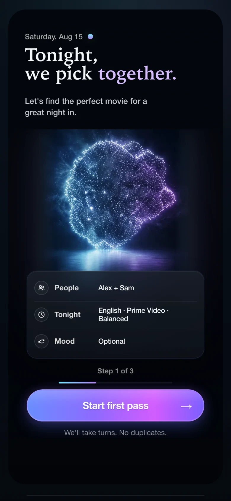
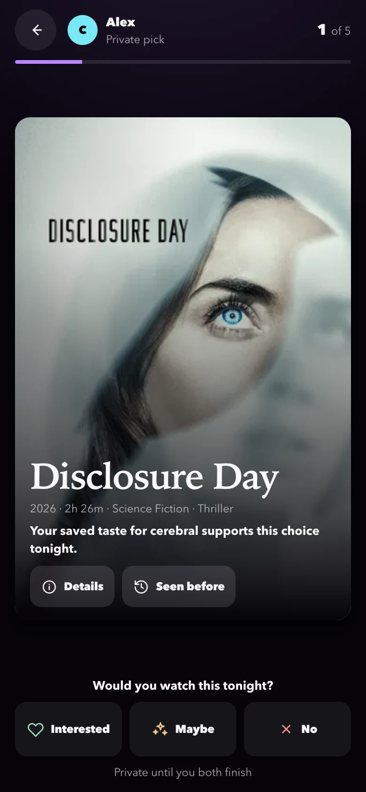
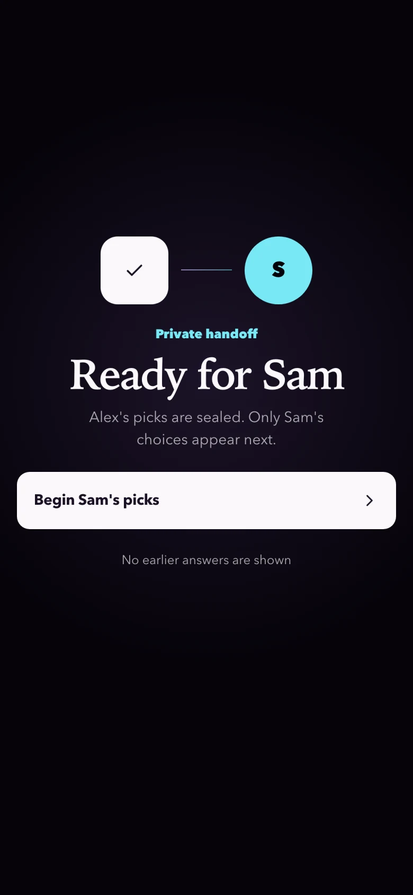
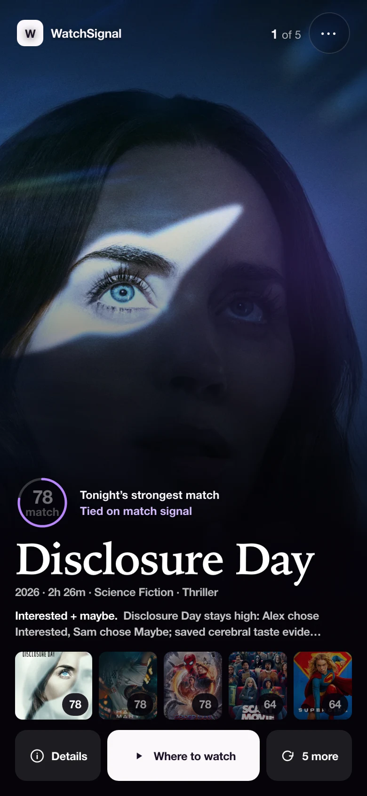
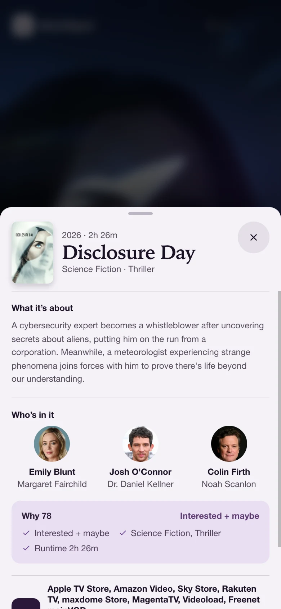
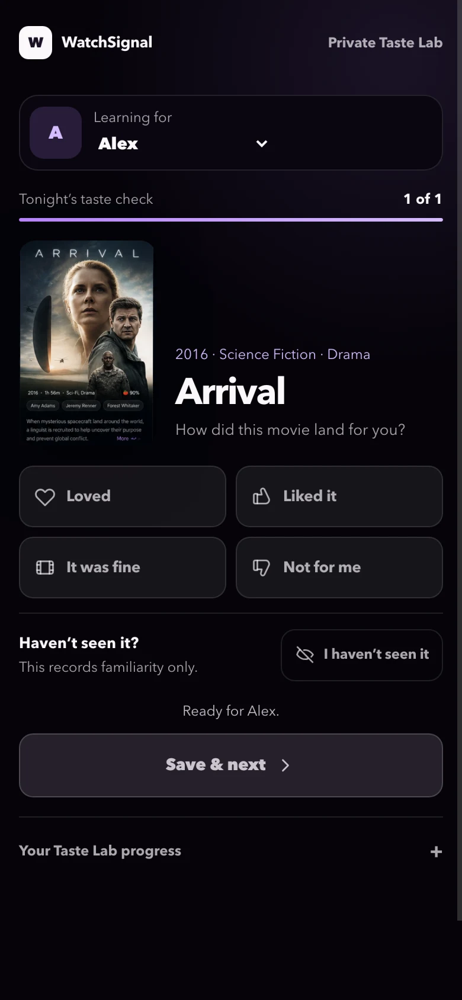
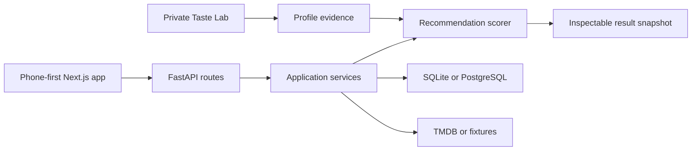

# WatchSignal

**Decide what to watch without showing your hand.**

WatchSignal helps two people make one good movie choice through private reactions, a sealed handoff, and a ranked result they can inspect together.

<p>
  <a href="#see-the-night-unfold">See the flow</a>
  ·
  <a href="#start-in-one-command">Run it locally</a>
  ·
  <a href="docs/architecture/code-first-app-architecture.md">Architecture</a>
  ·
  <a href="docs/recommendation-evaluation.md">Evaluation</a>
</p>

> WatchSignal is an active, household-protected prototype.
> There is no public demo because real profiles and movie-night choices stay behind household access.

## See the night unfold

A round moves from setup to private decisions, then through a sealed handoff to one ranked result.

<p align="center">
  
  
  <br>
  <sub>From left: <strong>1. Set the night</strong> by confirming the viewers and limits; <strong>2. Pick in private</strong> without seeing the other person's choices.</sub>
</p>

<p align="center">
  
  
  <br>
  <sub>From left: <strong>3. Pass the phone</strong> after the first picks are sealed; <strong>4. Get one shared answer</strong> with a clear reason and strong alternatives.</sub>
</p>

## Why it exists

Choosing a movie together is rarely a search problem.
It is a small negotiation shaped by different tastes, tiredness, streaming availability, and the fear that one person's enthusiasm will sway the other.

WatchSignal makes that negotiation quieter.
It gathers each person's honest reaction first, removes deal-breakers, then shows the strongest shared option with a reason that can be checked.

The goal is not an endless feed.
The goal is to reach a decision and start the movie.

## How a round works

1. Confirm one or two viewer profiles and tonight's viewing limits.
2. Add a few Loved, Ok, and No seeds when a profile still needs a starting point.
3. React privately to five movies.
4. Seal the first pass before handing over the phone.
5. Remove hard no choices and rank the remaining overlap.
6. Show the clearest shared pick, provider guidance, and a short explanation.
7. Keep watchlist actions, seen-before memory, and post-watch feedback for future rounds.

The flow supports compromise, person-first, and safe-pick modes without turning the couch experience into a settings panel.

## What is working

- A phone-first round from setup through private picks, handoff, matching, and outcome feedback.
- Keyboard support, focus-managed dialogs, reduced motion, safe areas, and 200 percent text zoom.
- Filters for streaming availability, watched titles, media type, horror exclusions, and other hard limits.
- Persistent profiles, sessions, reactions, results, watchlists, and recommendation snapshots.
- Live TMDB candidates with a deterministic fixture fallback for local work and tests.
- A review mode that exposes scoring inputs and signals without spilling diagnostics into the household flow.

## Trust is part of the product

### Private until both people finish

One viewer never sees the other's reactions during the handoff.
For API-backed couple rounds, the browser stores only an opaque recovery token while the private state stays behind the API boundary.

### A hard no stays a no

WatchSignal filters deal-breakers before it ranks the shared options.
The scorer cannot turn a strong preference from one person into pressure on the other.

### Explanations stay readable

The result says what cleared the match and why it fits tonight.
Deeper movie details, cast, availability, and recommendation evidence stay available without crowding the decision.

<p align="center">
  
  <br>
  <sub>The same winning title opens into its story, cast, match reasons, and viewing options.</sub>
</p>

### Refresh without revealing the first pass

API-backed handoff and matching checkpoints survive a refresh.
If durable recovery is unavailable, the app fails closed and gives a safe way to restart instead of exposing partial answers.

## Taste Lab learns the person, not the couple

Taste Lab is an optional private calibration tool.
Fast ratings add evidence to one profile without overwriting movie-night reactions or requiring the other person to share the same taste.

<p align="center">
  
</p>

WatchSignal can also learn from watch history, shortlist reactions, and post-watch feedback.
That evidence improves later candidates while tonight's explicit choices remain in control.

## Recommendation work, kept in its place

The household flow currently uses an inspectable heuristic scorer because tonight's mood, hard constraints, and compromise are not captured by a historical ratings dataset.

The offline evaluation program compares heuristics, popularity, collaborative filtering, and hybrid models on chronological MovieLens holdouts.
Its latest round selected a compact collaborative model over the hybrid through the protocol's simplicity route, with similar ranking quality and lower artifact, fit-time, and scoring costs.
That model is the current offline individual-taste champion, not the automatic household default.

Read the [evaluation narrative](docs/recommendation-evaluation.md), [locked benchmark protocol](docs/validation/movielens-benchmark-protocol.md), and [product integration decision](docs/validation/learned-taste-product-integration.md) for the full evidence trail.

## Start in one command

The Docker path starts the Next.js app, FastAPI service, deterministic movie fixtures, and a persistent local SQLite volume.
It does not need an API key.

```bash
docker compose up --build
```

Open [http://localhost:3000](http://localhost:3000).
The API health check is at [http://localhost:8000/health](http://localhost:8000/health).

Stop the stack when you are done.

```bash
docker compose down
```

Use `docker compose down --volumes` only when you also want to remove the local demo database.

## Native development

You will need Node.js 22.6 or newer, pnpm 10, Python 3.11 or newer, and [uv](https://docs.astral.sh/uv/).

Install the JavaScript dependencies.

```bash
pnpm install
```

Start the API.

```bash
cd apps/api
uv run uvicorn movie_night_mediator.api.main:app --reload
```

In a second terminal, start the web app from the repository root.

```bash
pnpm dev:web
```

The default development path uses deterministic candidates and local SQLite storage.
Copy `.env.example` to `.env` only when you want optional live services such as TMDB.

The synthetic review route is available locally at [http://localhost:3000/showcase](http://localhost:3000/showcase).
Showcase and prototype routes are hidden in production.

## Architecture


```mermaid
flowchart LR
    A[Phone-first Next.js app] --> B[FastAPI routes]
    B --> C[Application services]
    C --> D[Recommendation scorer]
    C --> E[SQLite or PostgreSQL]
    C --> F[TMDB or fixtures]
    G[Private Taste Lab] --> H[Profile evidence]
    H --> D
    D --> I[Inspectable result snapshot]
```

Recommendation logic is separate from transport, persistence, and the interface.
That boundary keeps scoring testable without a browser and leaves room for another client without hiding product decisions in workflow state.

SQLite is the deliberately simple local default.
Hosted deployments can use PostgreSQL without changing the core product boundary.

## Validation

Run the main repository checks and production web build.

```bash
pnpm check
pnpm build:web
```

The main check covers tooling tests, the Python suite, compile checks, and web state tests.
Continuous integration also builds both demo containers and probes the web and API health endpoints.

The repository does not publish raw household data, downloaded MovieLens files, or generated user-level research artifacts.
Committed protocols and checksums keep the evaluation inspectable without pretending the data is ours to redistribute.

## Key documents

- [MVP decision summary](docs/architecture/mvp-decision-summary.md)
- [Code-first architecture](docs/architecture/code-first-app-architecture.md)
- [Shared session state machine](docs/architecture/shared-session-state-machine.md)
- [Mode-aware shared scoring](docs/architecture/mode-aware-shared-scoring.md)
- [Recommendation evaluation](docs/recommendation-evaluation.md)
- [Taste Lab research brief](docs/taste-lab-research-brief.md)
- [Public data policy](docs/public-data-policy.md)
- [Fresh-checkout beta runbook](docs/beta-readiness/fresh-checkout-runbook.md)

## Movie data

Live movie metadata and poster images come from [The Movie Database](https://www.themoviedb.org).
This product uses the TMDB API but is not endorsed or certified by TMDB.
The required attribution also appears on the app's credits page.

## Status

WatchSignal is an actively developed prototype for a real two-person household flow.
The interface, private handoff, durable recovery, persistence, and recommendation evidence are working.
Household access still protects the hosted product, and review-only routes remain development tools.

The next proof is repeated real movie nights: whether both people trust the result, whether they reach it faster, and whether better personal taste evidence improves the shared decision.
