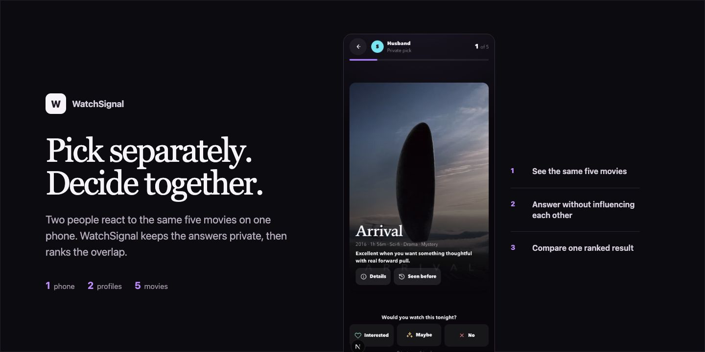
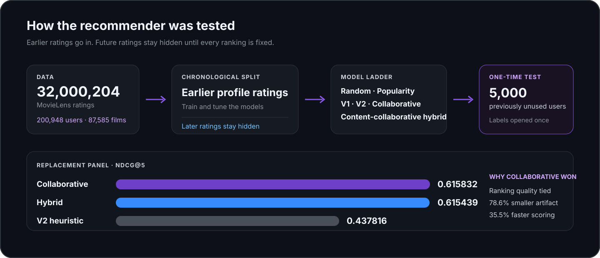

<h1 align="center">WatchSignal</h1>

<p align="center"><strong>A private movie picker for two people sharing one phone.</strong></p>

<p align="center">
  Each person reacts to the same five movies without seeing the other's answers.
  WatchSignal combines both taste profiles, tonight's needs, streaming availability, and those private reactions into one ranked result.
</p>

<p align="center">
  <a href="#how-a-round-works">Product tour</a>
  ·
  <a href="#how-the-recommender-was-trained-and-tested">Recommendation research</a>
  ·
  <a href="#run-it-locally">Run locally</a>
  ·
  <a href="docs/architecture/code-first-app-architecture.md">Architecture</a>
</p>

<p align="center">
  
</p>

## What WatchSignal does

Movie night is not usually blocked by a lack of titles.
It is blocked by two people with different tastes trying to choose without steering each other's answers.

WatchSignal gives each person a private turn, remembers what each profile likes and rejects, and returns a short ranked answer instead of another endless feed.
The result explains why the top movie fits, keeps four alternatives close by, and links to the right streaming service when provider data is available.

The current product includes:

- A complete phone-first flow from setup to private picks, handoff, matching, ranked result, watchlist, and post-watch feedback.
- Separate taste profiles built from onboarding, Taste Lab ratings, earlier movie-night reactions, watched history, and feedback.
- Learned candidate retrieval from a MovieLens and TMDB-linked catalog, with TMDB popularity used only as an exploration fallback.
- Hard checks for streaming availability, watched titles, media type, explicit exclusions, and confirmed tonight-specific requests.
- A review mode with inspectable scoring evidence that stays out of the normal household experience.

## How a round works

<p align="center">
  
</p>

1. Both people confirm the night, including who is watching, the streaming service, and any firm limits.
2. The first person reacts to five movies in private, then hands over the phone.
3. The second person sees the same five without seeing the first answers.
4. WatchSignal ranks the overlap, explains the strongest match, and keeps the next four options available.

There is also a solo mode.
The two-person flow is the main product because it protects independent opinions before the result is shown.

## How the live recommendation path works

The learned system does not begin with a short TMDB popularity page and hope the scorer can rescue it.
It starts from the trained MovieLens item space and a compact MovieLens-to-TMDB catalog, retrieves candidates that resemble each active profile, then asks TMDB to hydrate those exact movies and confirm that they are watchable.

Three layers have different jobs:

1. **Personal retrieval** searches collaborative and content-informed movie spaces using each person's durable ratings.
2. **Household ranking** weighs both people, the weaker-person floor, current reactions, confirmed requests, and hard constraints.
3. **TMDB** supplies current metadata, artwork, and regional provider availability, with popularity retained as a bounded exploration fallback when learned retrieval or provider-eligible hydration cannot fill the pool.

The live web route requests the hybrid learned scorer with the existing V2 household rules.
If its model or link artifacts are unavailable, scoring explicitly falls back to V2 and marks the result uncertain.
V1, V2, and collaborative-only paths remain available as explicit rollback and comparison routes.

## How the recommender was trained and tested

<p align="center">
  
</p>

The training program used the official [MovieLens 32M dataset](https://files.grouplens.org/datasets/movielens/ml-32m-README.html): 32,000,204 ratings from 200,948 users across 87,585 movies.
For the main task, the model received each person's earlier ratings and ranked 30 movies that person rated later.
A separate evaluator revealed the later ratings only after every ranking was fixed.

Users were assigned to non-overlapping fit, tuning, internal-test, and one-time hidden-test roles.
The split was chronological, future labels were excluded from training and feature construction, and the manifests and model artifacts were fingerprinted.
Both hidden panels were opened once and are now treated as spent evidence.

The benchmark compared deterministic random order, popularity, two hand-written scorers, ratings-only matrix factorization, and a hybrid with genre, release-era, and tag features.
Models were judged on NDCG@5, positive-versus-negative ordering, known dislikes in the top five, coverage, confidence intervals, and measured runtime costs.
Training error was recorded but could not select the winner.

The final 16-factor explicit ALS model was trained on 2,395,300 earlier profile ratings from 10,187 development-fit users.
On a fresh panel of 5,000 previously unused users, it scored `0.615832` NDCG@5, compared with `0.615439` for the support-aware hybrid and `0.437816` for the V2 heuristic.
The collaborative and hybrid results were effectively tied, so the collaborative model won the predeclared simplicity route: a 78.6 percent smaller artifact, 43.5 percent lower fit time, and 35.5 percent lower same-loop scoring time.

### The research behind the work

The papers framed the dataset, model family, evaluation method, and product boundaries.
WatchSignal's protected experiments, not the papers, selected the factor count, regularization, iteration count, features, and final model.

| Research | Relevance to WatchSignal |
| --- | --- |
| [Harper and Konstan, *The MovieLens Datasets: History and Context*](https://doi.org/10.1145/2827872) | The provenance, scale, and limitations of the ratings corpus. |
| [Koren, Bell, and Volinsky, *Matrix Factorization Techniques for Recommender Systems*](https://doi.org/10.1109/MC.2009.263) | The latent user-and-movie factor family used by the explicit-feedback collaborative model. |
| [Järvelin and Kekäläinen, *Cumulated Gain-Based Evaluation of IR Techniques*](https://doi.org/10.1145/582415.582418) | The NDCG family used to reward highly rated movies near the top of a five-item ranking. |
| [Meyer and colleagues, *Toward a New Protocol to Evaluate Recommender Systems*](https://arxiv.org/abs/1209.1983) | The decision to evaluate useful ranking by cohort rather than choose the lowest rating-prediction error. |
| [Çano and Morisio, *Hybrid Recommender Systems*](https://doi.org/10.3233/IDA-163209) | The case for testing collaborative evidence together with content features for sparse movies. |
| [Peška and Vojtáš, *Off-Line vs. On-Line Evaluation of Recommender Systems*](https://doi.org/10.1145/3372923.3404781) | The rule that an offline ranking gain cannot replace real product evidence. |
| [Basu Roy, Lakshmanan, and Liu, *From Group Recommendations to Group Formation*](https://doi.org/10.1145/2723372.2749448) | The decision to treat two-person satisfaction as a separate household problem rather than average two personal scores and stop. |

<details>
  <summary><strong>Taste Lab and cold-start research</strong></summary>

Taste Lab asks for quick, private ratings so a new profile can become useful before years of watch history exist.
[Meng and colleagues](https://arxiv.org/abs/2010.14013), [Nguyen and colleagues](https://arxiv.org/abs/2406.00973), and [Pennock and colleagues](https://arxiv.org/abs/1301.3885) informed the idea that some questions reveal more about a person's preferences than an arbitrary queue.
The current product uses an inspectable signal heuristic for that queue.
It does not claim to reproduce any of those papers' algorithms.

</details>

### What the experiment proves, and what it does not

The result identifies a strong offline model for one person's historical movie taste.
It does not prove that two people will agree with the result tonight, that the catalog contains the right movie, or that an offline score predicts trust and satisfaction.

That is why learned personal retrieval and scoring remain separate from household compromise, current mood, provider availability, explicit exclusions, and the final explanation.
The next standard is repeated real movie nights, not another isolated benchmark number.

The full evidence trail is in [Recommendation Evaluation at WatchSignal](docs/recommendation-evaluation.md), the [locked benchmark protocol](docs/validation/movielens-benchmark-protocol.md), the [replacement-panel result](docs/validation/movielens-replacement-sealed-benchmark.md), and the [live retrieval rollout](docs/validation/personalized-retrieval-rollout.md).

## Run it locally

The Docker path starts the Next.js app, FastAPI service, deterministic movie fixtures, and a persistent local SQLite volume.
It does not need an API key.

```bash
docker compose up --build
```

Open [http://localhost:3000](http://localhost:3000).
The API health check is at [http://localhost:8000/health](http://localhost:8000/health).

```bash
docker compose down
```

Use `docker compose down --volumes` only when you also want to remove the local demo database.

<details>
  <summary><strong>Native development</strong></summary>

You will need Node.js 22.6 or newer, pnpm 10, Python 3.11 or newer, and [uv](https://docs.astral.sh/uv/).

```bash
pnpm install
cd apps/api
uv run uvicorn movie_night_mediator.api.main:app --reload
```

In a second terminal, start the web app from the repository root.

```bash
pnpm dev:web
```

Copy `.env.example` to `.env` only when you want optional live services and local learned-model artifacts.

</details>

## Stack and boundaries

- **Interface:** Next.js and React, designed first for one shared phone.
- **API:** FastAPI application services with explicit recommendation and recovery boundaries.
- **Storage:** SQLite locally and PostgreSQL for hosted multi-instance persistence.
- **Movie data:** TMDB for live metadata, artwork, and provider availability.
- **Recommendation:** NumPy-based explicit ALS and hybrid artifacts, with V2 household scoring and inspectable snapshots.

Recommendation logic is separate from transport, persistence, and the interface.
The app does not load the full MovieLens 32M ratings dataset or any MovieLens user history at recommendation time.
The runtime artifacts contain movie factors and mappings, not raw household histories or MovieLens user vectors.

## Validation and project status

Run the repository checks and production web build with:

```bash
pnpm check
pnpm build:web
```

WatchSignal is an actively developed, household-protected prototype.
There is no public demo because real profiles and movie-night choices stay behind household access.
The complete flow, private handoff, persistence, learned retrieval, ranked results, and feedback loops are implemented, while the recommendation quality claim remains deliberately open to real household use.

Useful project documents:

- [MVP decision summary](docs/architecture/mvp-decision-summary.md)
- [Code-first architecture](docs/architecture/code-first-app-architecture.md)
- [Shared session state machine](docs/architecture/shared-session-state-machine.md)
- [Recommendation evaluation](docs/recommendation-evaluation.md)
- [Taste Lab research brief](docs/taste-lab-research-brief.md)
- [Public data policy](docs/public-data-policy.md)

## Movie data and licensing

Live movie metadata and poster images come from [The Movie Database](https://www.themoviedb.org).
This product uses the TMDB API but is not endorsed or certified by TMDB.

MovieLens 32M is used under its research terms for local training and evaluation.
The repository does not redistribute the downloaded dataset, raw user rows, or detailed identifier-bearing evaluation artifacts.
