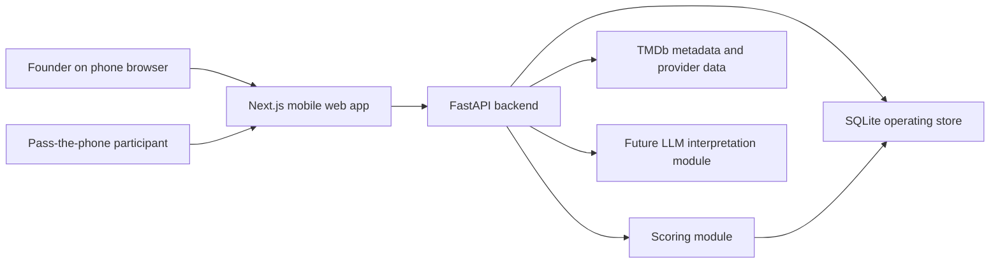
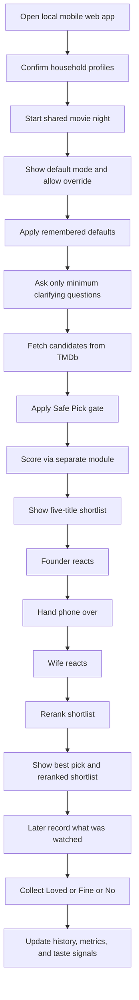
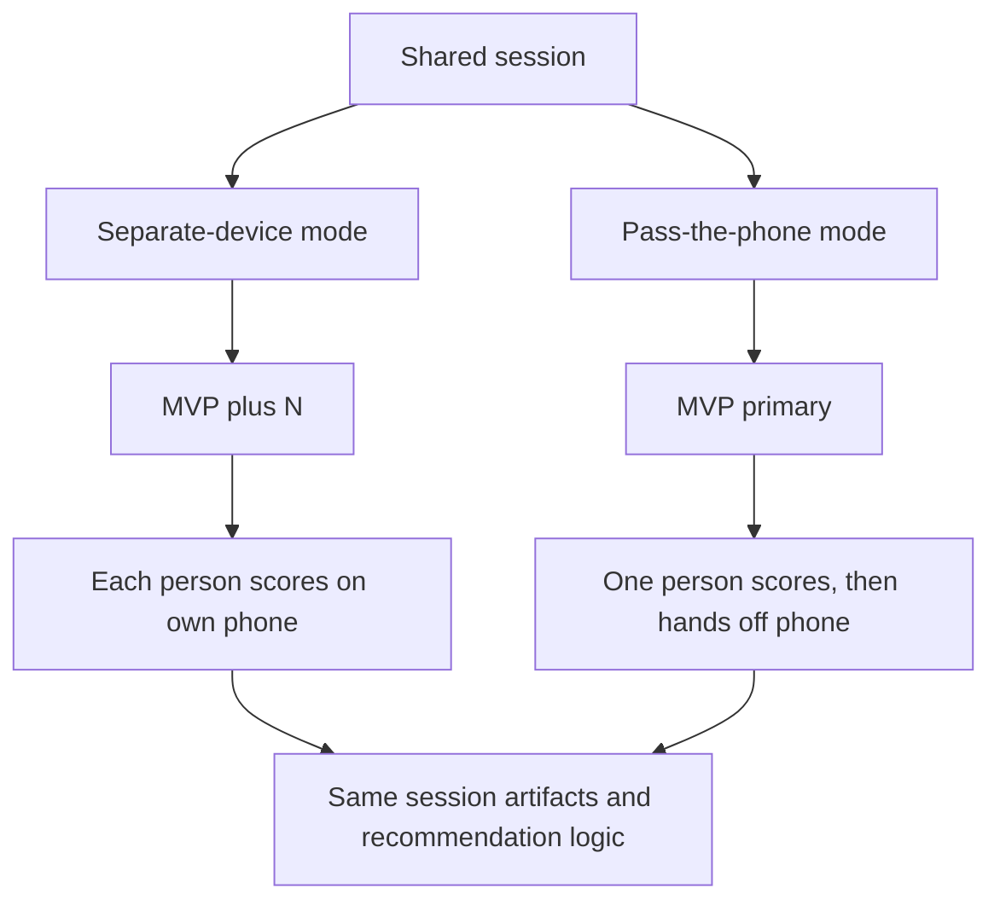
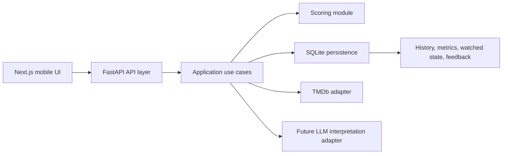
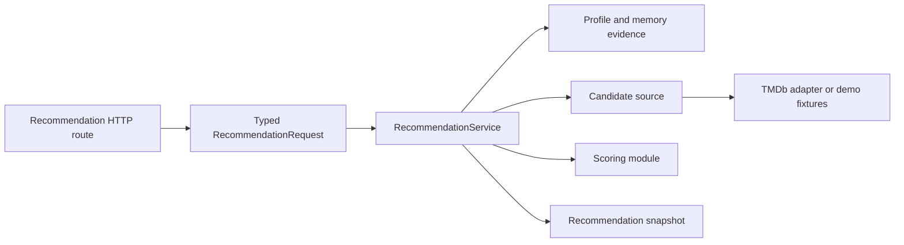
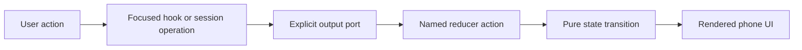
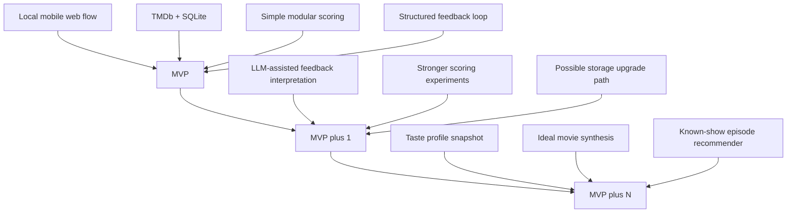
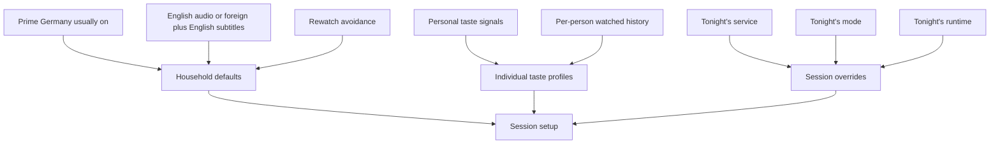

# Architecture Overview

This document is the visual companion to the founder decisions and workflow map.
It is intentionally high-level.
It should evolve as the real system evolves.

## System context

## First vertical slice flow

## Shared-session input modes

## Responsibility split

## Recommendation application boundary

The API route validates and translates HTTP payloads but does not execute the recommendation workflow.
`RecommendationService` owns profile and memory evidence loading, candidate-source selection, fetch budgeting, scorer selection, shortlist generation, snapshot creation, and application-level failure semantics.
The TMDb adapter owns provider communication and candidate construction.
The scoring module owns ranking policy and evidence generation.

The live candidate pipeline has one execution path for fetching, exclusion, enrichment, watched-state marking, scoring, and snapshotting.
Callers may request ranked domain candidates or display-ready shortlist items without duplicating that pipeline.

## Pass-the-phone state boundaries

The pass-the-phone UI uses pure reducers for flow state and wizard navigation.
Session synchronization, tonight-intent interpretation, results evidence, history panels, and navigation advance through named transitions.
Application-level session operations own shortlist loading, shared-session creation, fallback recovery, continuation scoring, reaction persistence, seen-memory persistence, and handoff advancement.
Those operations receive explicit state snapshots and output ports, so they can be tested without rendering React components.
Focused hooks own asynchronous UI concerns for tonight-intent interpretation, session history, and results persistence.
Components render the resulting state and do not directly choose arbitrary synchronization or wizard states.
The main wizard is the composition layer that connects reducers, application operations, hooks, and screen components.
Review-only evidence fixtures live outside the production orchestration component.

The results screen delegates outcome capture, watchlist behavior, watched-state recording, and post-watch feedback persistence to a dedicated results controller.
The results component is responsible for composing panels and presentation, while the controller owns backend mutations and their local loading, error, and saved states.

## Upgrade path

## Constraint model

