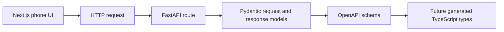

# API Contracts

This repo uses pragmatic REST APIs between the phone UI and backend.
FastAPI and Pydantic are the source of truth for request and response schemas.
FastAPI's generated OpenAPI schema is the machine-readable contract.

## Contract Flow



## API Style

Use resource-level routes by default.
Use workflow action routes when a real domain transition is clearer than forcing a pure REST shape.

Examples:

- `POST /households`
- `POST /sessions`
- `GET /sessions/{session_id}`
- `POST /sessions/{session_id}/reactions`
- `POST /sessions/{session_id}/rerank`
- `POST /sessions/{session_id}/outcome`

## MVP Contract Priorities

- household setup
- profile setup
- hybrid title resolution
- shared pass-the-phone session start
- five-title Safe Pick shortlist
- per-person shortlist reactions
- reranked recommendation
- outcome capture
- post-watch feedback

## Setup Contract Draft

Slice 3 uses a narrow frontend API boundary while Slice 2 owns backend persistence.
The web app currently probes `GET /setup` and falls back to generic local defaults when that endpoint is unavailable.
Worker A can satisfy this boundary without changing the setup screen shape.

Expected `GET /setup` response:

```json
{
  "householdLabel": "Household",
  "profiles": [
    { "id": "profile-1", "label": "Husband", "order": 1 },
    { "id": "profile-2", "label": "Wife", "order": 2 }
  ],
  "defaults": {
    "sessionType": "Movie night",
    "inputMode": "Pass the phone",
    "availabilityRegion": "Prime Video Germany",
    "languageAccess": "English audio or verified English subtitles",
    "shortlistSize": 5,
    "avoidAlreadyWatched": true
  }
}
```

Expected save endpoint:

- `PUT /setup`

The save request should accept the same shape as `GET /setup`.
The response may return the saved setup in the same shape.
Real household labels are local runtime data and should not be committed to fixtures or docs.

## Learning Note

An API contract is the agreement between frontend and backend.
It says which endpoints exist, which data the frontend sends, which data the backend returns, and what errors can happen.
Keeping this explicit helps autonomous agents work in parallel without guessing what the other side expects.

## Setup API Learning Note

The browser setup screen talks to FastAPI through `GET /setup` and `PUT /setup`.
`GET /setup` returns the persisted setup wizard shape when SQLite has a saved row, otherwise it returns generic local defaults.
`PUT /setup` accepts the same shape, validates it through the API models, and stores the household label, profile labels, and setup defaults in SQLite.
The backend stores this browser-facing setup shape separately from recommendation scoring so future transport adapters can reuse the setup data without coupling it to the phone UI.
