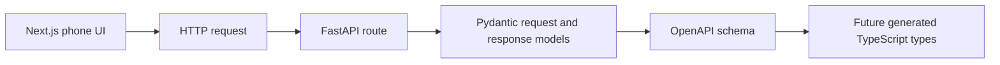

# API Contracts

This repo uses pragmatic REST APIs between the phone UI and backend.
FastAPI and Pydantic are the source of truth for request and response schemas.
FastAPI's generated OpenAPI schema is the machine-readable contract.

## Contract Flow



## API Style

Use resource-level routes by default.
Use workflow action routes when a real domain transition is clearer than forcing a pure REST shape.

Examples:

- `POST /households`
- `POST /sessions`
- `GET /sessions/{session_id}`
- `POST /sessions/{session_id}/reactions`
- `POST /sessions/{session_id}/advance-handoff`
- `POST /sessions/{session_id}/outcome`

## MVP Contract Priorities

- household setup
- profile setup
- hybrid title resolution
- shared pass-the-phone session start
- five-title Safe Pick shortlist
- per-person shortlist reactions
- reranked recommendation
- outcome capture
- post-watch feedback

## Offline Recommendation Shortlist Contract

The first recommendation API boundary is intentionally offline and fixture-backed.
It does not call live TMDb, scraping, LLMs, or paid provider services.
It exposes the deterministic demo couple shortlist in the shape the local web app can later consume when live provider integration exists.

Expected endpoint:

- `GET /recommendations/shortlist`

Expected response:

```json
[
  {
    "sourceMovieId": "fixture:shared-time-loop",
    "title": "Shared Time Loop",
    "candidateRank": 1,
    "releaseYear": 2024,
    "runtimeMin": 108,
    "genres": ["Comedy", "Sci-Fi"],
    "providerNames": ["Prime Video"],
    "fitBucket": "compromise",
    "groupScore": 0.67,
    "whyShort": "Interesting Safe Pick. Fits compromise mode with signal from Comedy, Sci-Fi. Husband: 0.67; Wife: 0.67.",
    "isInterestingPick": true
  }
]
```

The response always returns five Safe Pick fixture candidates in stable rank order.
The route is a provider-shaped boundary, not a live provider integration.
Later TMDb and availability adapters should replace the fixture source behind this API without changing the web-facing shortlist fields unless the product contract changes.

## Debug History Contract

Debug history exposes read-only evidence for inspecting a saved local session.
It is intentionally narrower than a full recommendation audit trail because persisted recommendation snapshots do not exist yet.

Expected endpoint:

- `GET /debug/history/sessions/{sessionId}`

Expected response:

```json
{
  "sessionId": "session-1",
  "householdId": "default-household",
  "activeMode": "compromise",
  "state": "reranked",
  "participantIds": ["husband", "wife"],
  "shortlist": [
    { "sourceMovieId": "tmdb:603", "title": "The Matrix", "candidateRank": 1 }
  ],
  "founderReactions": [
    {
      "participantId": "husband",
      "sourceMovieId": "tmdb:603",
      "reactionLabel": "interested"
    }
  ],
  "wifeReactions": [
    {
      "participantId": "wife",
      "sourceMovieId": "tmdb:603",
      "reactionLabel": "maybe"
    }
  ],
  "rerankedSourceMovieIds": ["tmdb:603"],
  "bestPickSourceMovieId": "tmdb:603",
  "postWatchFeedback": [
    {
      "userId": "wife",
      "sourceMovieId": "tmdb:603",
      "feedbackLabel": "loved",
      "hasFreeTextNote": true
    }
  ],
  "unavailableEvidence": [
    "recommendation_scoring_request",
    "candidate_inputs",
    "hard_filter_results",
    "per_person_scores",
    "group_scores",
    "fit_buckets",
    "safe_pick_flags"
  ]
}
```

Missing sessions return `404`.
The endpoint does not return raw free-text feedback notes.
The endpoint does not invent score history from the current shortlist.
Future persisted recommendation snapshots can extend this route or add a sibling route once the storage model exists.

## Post-Watch Feedback Contract

Post-watch feedback records a participant's later opinion about a watched title.
The MVP API keeps this separate from outcome capture and watched-history updates.

Expected save endpoint:

- `POST /feedback/post-watch`

Expected save request:

```json
{
  "householdId": "default-household",
  "sessionId": "session-1",
  "userId": "husband",
  "sourceMovieId": "tmdb:603",
  "feedbackLabel": "loved",
  "freeTextNote": "Still plays well."
}
```

Expected save response:

```json
{
  "sessionId": "session-1",
  "userId": "husband",
  "sourceMovieId": "tmdb:603",
  "feedbackLabel": "loved",
  "freeTextNote": "Still plays well."
}
```

Expected list endpoint:

- `GET /feedback/post-watch?householdId=default-household`
- `GET /feedback/post-watch?householdId=default-household&sessionId=session-1`

The list response is an array of the save response shape.
Feedback labels are normalized to `loved`, `fine`, or `no`.
Invalid labels, blank ids, and blank filter values return `400`.
Duplicate feedback for the same household, session, participant, and source movie updates the existing row.

## Shared Session Contract

Shared sessions are the backend contract for the pass-the-phone wizard.
The API returns the same browser-friendly session shape from every session route so the frontend can replace local state with the response after each transition.

Expected endpoints:

- `POST /sessions`
- `GET /sessions/{session_id}`
- `PUT /sessions/{session_id}`
- `POST /sessions/{session_id}/reactions`
- `POST /sessions/{session_id}/advance-handoff`

Expected response shape:

```json
{
  "sessionId": "session-1",
  "householdId": "default-household",
  "activeMode": "compromise",
  "participantIds": ["husband", "wife"],
  "state": "reranked",
  "shortlist": [
    { "sourceMovieId": "tmdb:1", "title": "First Pick", "candidateRank": 1 }
  ],
  "founderReactions": [
    { "sourceMovieId": "tmdb:1", "reactionLabel": "interested" }
  ],
  "wifeReactions": [
    { "sourceMovieId": "tmdb:1", "reactionLabel": "maybe" }
  ],
  "rerankedSourceMovieIds": ["tmdb:1"],
  "rerankedShortlist": [
    { "sourceMovieId": "tmdb:1", "title": "First Pick", "candidateRank": 1 }
  ],
  "bestPickSourceMovieId": "tmdb:1"
}
```

`shortlist` always contains the original five-title candidate order.
`rerankedSourceMovieIds` and `rerankedShortlist` are empty until the second reaction pass completes.
After reranking, `rerankedShortlist` contains the same title objects as `shortlist`, ordered for the result screen.
This lets the frontend render the final recommendation without joining ids back to titles.

The create request requires exactly two participant ids and exactly five shortlist items.
FastAPI request validation returns `422` for malformed payload shape, including a shortlist that is too short or too long.
Domain validation returns `400` for incomplete onboarding, duplicate shortlist ids, missing reactions, duplicate reaction ids that leave another shortlist item unreached, or reactions that do not match the shortlist.
Wrong participant submissions and invalid state transitions return `409`.
Missing sessions return `404`.

## Setup Contract Draft

Slice 3 uses a narrow frontend API boundary while Slice 2 owns backend persistence.
The web app currently probes `GET /setup` and falls back to generic local defaults when that endpoint is unavailable.
Worker A can satisfy this boundary without changing the setup screen shape.

Expected `GET /setup` response:

```json
{
  "householdLabel": "Household",
  "profiles": [
    { "id": "profile-1", "label": "Husband", "order": 1 },
    { "id": "profile-2", "label": "Wife", "order": 2 }
  ],
  "defaults": {
    "sessionType": "Movie night",
    "inputMode": "Pass the phone",
    "availabilityRegion": "Prime Video Germany",
    "languageAccess": "English audio or verified English subtitles",
    "shortlistSize": 5,
    "avoidAlreadyWatched": true
  }
}
```

Expected save endpoint:

- `PUT /setup`

The save request should accept the same shape as `GET /setup`.
The response may return the saved setup in the same shape.
Real household labels are local runtime data and should not be committed to fixtures or docs.

## Learning Note

An API contract is the agreement between frontend and backend.
It says which endpoints exist, which data the frontend sends, which data the backend returns, and what errors can happen.
Keeping this explicit helps autonomous agents work in parallel without guessing what the other side expects.

## Setup API Learning Note

The browser setup screen talks to FastAPI through `GET /setup` and `PUT /setup`.
`GET /setup` returns the persisted setup wizard shape when SQLite has a saved row, otherwise it returns generic local defaults.
`PUT /setup` accepts the same shape, validates it through the API models, and stores the household label, profile labels, and setup defaults in SQLite.
The backend stores this browser-facing setup shape separately from recommendation scoring so future transport adapters can reuse the setup data without coupling it to the phone UI.

## Manual Backfill Learning Note

Manual backfill is a low-polish backend utility for adding known watched titles before richer history screens exist.
It accepts the same resolved-or-unresolved title entry shape used by title resolution, then stores watched status for selected participants, the global household history, or both.
Backfill taste labels are limited to `loved`, `fine`, and `no` so they can become useful taste signals later without changing the scoring formula in this slice.
Duplicate backfill writes are idempotent for the same household, watched scope, participant, and normalized title key.
This keeps manual imports reversible and inspectable while preserving onboarding seeds as a separate source of preference hints.
