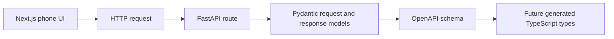

# API Contracts

This repo uses pragmatic REST APIs between the phone UI and backend.
FastAPI and Pydantic are the source of truth for request and response schemas.
FastAPI's generated OpenAPI schema is the machine-readable contract.

## Contract Flow

## API Style

Use resource-level routes by default.
Use workflow action routes when a real domain transition is clearer than forcing a pure REST shape.

Examples:

- `POST /households`
- `POST /sessions`
- `GET /sessions/{session_id}`
- `POST /sessions/{session_id}/reactions`
- `POST /sessions/{session_id}/rerank`
- `POST /sessions/{session_id}/outcome`

## MVP Contract Priorities

- household setup
- profile setup
- hybrid title resolution
- shared pass-the-phone session start
- five-title Safe Pick shortlist
- per-person shortlist reactions
- reranked recommendation
- outcome capture
- post-watch feedback

## Learning Note

An API contract is the agreement between frontend and backend.
It says which endpoints exist, which data the frontend sends, which data the backend returns, and what errors can happen.
Keeping this explicit helps autonomous agents work in parallel without guessing what the other side expects.
