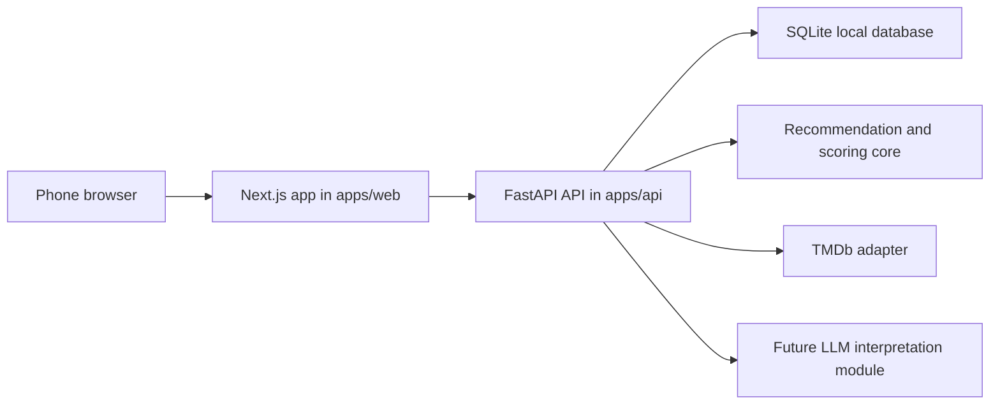

# Code-First App Architecture

This document records the recommended first architecture for this repo.
It is separate from the n8n project and does not change n8n project decisions.

## Alignment Summary

Movie Night Mediator is a private household decision tool.
The core problem is not catalog browsing.
The core problem is helping one or two people pick something to watch with less friction, while learning from real reactions and outcomes over time.

The code-first companion should use a local mobile web app as the MVP interface, keep Telegram as a possible later adapter, keep TMDb as the first metadata source, and keep visible operating storage as a useful early property.
It should not optimize for n8n.
Instead, it should make the product core testable in normal application code and keep external integrations behind adapters.

## Major Settled Decisions

- The product is a private household mediator, not a public movie app.
- The MVP interface is a local mobile web app opened from phones on the same couch and local network.
- Telegram remains a possible later adapter, not the primary code-first MVP interface.
- Solo, shared separate-device, and pass-the-phone use are in scope.
- Shared couple use is required before this project counts as MVP-shaped.
- Pass-the-phone is the primary MVP input mode.
- Separate-phone shared sessions are MVP plus N unless they are cheap to add safely.
- Movie is the default media type, with TV supported at the intake and recommendation level.
- TMDb is the first metadata source.
- Live TMDb is required before the app is described as live-usable outside fixture/demo mode, but fixture candidates are allowed for development and tests.
- Live candidate sourcing is now implemented and validated at the backend and contract level.
- The remaining live-usable MVP question is whether one final normal-browser or real-phone confirmation outside the current sandbox is still required before the label is declared closed.
- Live candidate sourcing is a next MVP readiness phase, not MVP plus 1 LLM work.
- Live poster provider integration, live critic-score provider integration, and richer availability verification are separate concerns from live candidate sourcing.
- Main recommendations should use Safe Picks by default.
- Safe Picks are Prime Video Germany, language-compatible, constraint-compatible, and not already watched unless rewatches are allowed.
- Uncertain availability, audio, or subtitle compatibility may appear only in a secondary Needs Quick Check section.
- Amazon DE access may be flatrate, rent, or buy as long as the title still passes the active language and watched-state rules.
- TMDb can help with provider and language data, but MVP code must not pretend it can fully verify provider-specific audio or subtitle tracks.
- Store manual verified-watchable corrections so the app can learn practical Prime Germany availability over time.
- Amazon.de availability and language constraints matter for normal use.
- Onboarding is required before real recommendations.
- One-sided onboarding unlocks solo recommendations.
- Shared compromise recommendations require both users to onboard.
- Household profiles are configurable during setup, with Husband and Wife as defaults.
- Seed and backfill title resolution should be hybrid: resolve through TMDb when possible, but allow unresolved text entries for later cleanup.
- The MVP shortlist should show five titles.
- The shortlist should include one interesting safe pick when possible.
- Shortlist reactions use Interested, Maybe, or No.
- Post-watch feedback uses Loved, Fine, or No.
- Optional free-text feedback should be captured from day one.
- Scoring must remain separate from transport, persistence, and orchestration.
- V1 scoring should be simple, inspectable, and replaceable.
- V1 scoring should prioritize watchability first, taste second, and session-mode weighting third.
- LLM interpretation is out of MVP and targeted for MVP plus 1.
- LLM usage is not ranking authority in MVP.
- Privacy and sanitization matter before any public artifact exists.

## Decisions Still Open

- Whether a solo tracer bullet should be implemented first as an engineering step before the required shared couple MVP loop.
- How much TMDb availability data is good enough before a second availability source is justified.
- The exact V1 scoring weights and the first evaluation method for comparing scorer changes.
- How remembered fairness defaults should evolve after repeated husband-first or wife-first sessions.
- How Treehouse and GNHF should be introduced once the project has clean issues and tests.

## Recommended Architecture

Use a layered app with a clean product core and a phone-first web surface.

- `domain`: shared data structures and vocabulary from the product docs.
- `scoring`: replaceable recommendation engines that accept a scoring request and return ranked candidates.
- `app`: use cases such as onboarding, solo recommendation, shared recommendation, outcome capture, and feedback capture.
- `storage`: repositories for visible operating state.
- `adapters`: mobile web, TMDb, persistence, fixture, and later Telegram adapters.

The app layer should know use cases.
The scoring layer should know only scoring inputs and outputs.
Adapters should translate external APIs into domain objects.
This keeps the code-first path portable and makes the recommendation brain testable without live credentials.

The selected professional shape is a Next.js mobile web frontend with a FastAPI Python recommendation and API backend.
SQLite is the local MVP source of truth.
Use pragmatic REST API endpoints with FastAPI/Pydantic as the source of truth for OpenAPI contracts.
Use `uv` for Python dependency management and `pnpm` for frontend dependency management.



## First Vertical Slice

Build a shared couple recommendation loop for MVP.
A solo path may still be useful as a small engineering tracer bullet, but it does not satisfy MVP by itself.

The slice should include:

- onboarding seed capture for both users
- shared pass-the-phone session start from the mobile web app
- husband-first, wife-first, and compromise mode selection
- fixture-backed candidates before live TMDb
- live TMDb before the app is considered live-usable outside fixture/demo mode
- Safe Picks as the main recommendation pool
- heuristic scorer behind the documented scoring contract
- persisted recommendation result
- shortlist reactions
- outcome capture
- post-watch feedback
- tests over the public behavior

The first product demo should work from two phones on the same local network.
After this works locally, hosted web, PWA behavior, Telegram, and native mobile can remain later options.

## Monorepo Layout

```text
apps/
  web/   phone-first Next.js UI
  api/   FastAPI backend, SQLite persistence, scoring, TMDb adapter
docs/    decisions, diagrams, and agent-operating guidance
```

Keep workstream boundaries clear so autonomous agents can own small slices without colliding.
Frontend agents should usually work in `apps/web`.
Backend, scoring, persistence, and API agents should usually work in `apps/api`.
Docs and issue-slicing agents should usually work in `docs`.

## MVP Plus N Interface Notes

Hosted web is the next likely step after local mobile web.
Native mobile is a later option only if the web or PWA path becomes limiting.
Autopreso is not needed for the app build.
It may be useful later for live whiteboard-style architecture or product presentations.

## Recommendation Upgrade Lane

LLM interpretation is out of MVP and targeted for MVP plus 1.
The MVP should still store optional free-text notes and structured feedback so later interpretation has useful inputs.

MVP plus 1 should add an LLM-assisted interpretation module for free-text feedback, rejection reasons, and taste summaries.
The LLM should enrich structured taste signals and explanations rather than becoming the sole ranking authority by default.

MVP plus N should add a recommender-evaluation workstream.
This can be assigned to a dedicated recommender agent once the app has stable scoring contracts and stored feedback.
The agent's job would be to improve ranking quality using offline evaluation, not to change product scope.

Useful future evaluation inputs may include:

- synthetic taste profiles
- the household's own accumulated feedback history
- public recommendation datasets where licensing and terms are appropriate
- held-out ratings or reactions used to test whether the recommender predicts likely enjoyment

The future evaluation loop should compare candidate scorers against a fixed test set before changing the production ranking behavior.
This keeps recommendation experimentation grounded in evidence instead of vibes.
