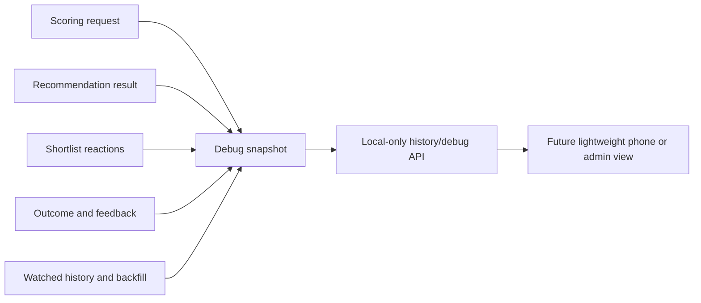

# History And Debug Visibility

## Purpose

History and debug visibility exists so the founder can trust, inspect, and improve the recommender.
The MVP should answer two different questions.
The first question is user-facing history: what happened in recent movie-night sessions.
The second question is debug visibility: why the app ranked or filtered titles the way it did.

## MVP Exposure

The MVP history view should expose recent sessions, their final recommendation, the reranked shortlist, the selected outcome, and post-watch feedback when present.
The MVP debug view should expose the candidate inputs, Safe Pick status, hard-filter result, per-person scores, group score, fit bucket, and short explanation that existed at recommendation time.
The debug view may also show onboarding completeness, watched-history records, manual backfill records, and whether free-text feedback exists.
The debug view should not interpret free-text feedback with an LLM in MVP.
The debug view should not expose API keys, environment variables, raw secrets, or private notes in committed examples.

## Snapshot Shape

The backend can build a read-only session debug snapshot from existing domain records.
The current helper lives in `apps/api/src/movie_night_mediator/app/debug_history.py`.
The rich scoring snapshot helper does not persist anything.
It combines a scoring request, recommendation result, shortlist reactions, post-watch feedback, and watched-history backfill records into a stable inspection shape.
The MVP API route is narrower because the current SQLite stores do not persist the original scoring request or recommendation result snapshot.
`GET /debug/history/sessions/{session_id}` returns the persisted shared-session evidence that exists after a local session.
That evidence includes session state, shortlist titles and ranks, participant reactions, reranked source movie ids, best pick id, post-watch feedback labels, and whether a feedback note exists.
The route also returns `unavailableEvidence` so callers can see that candidate inputs, hard-filter results, score breakdowns, fit buckets, and Safe Pick flags are not yet persisted.
The route is read-only and local-debug oriented.

## Constraints

History and debug visibility must be local-only for MVP.
Committed fixtures may use public movie metadata and generic profile labels.
Committed fixtures must not include real household watch history, ratings, free-text notes, or identifiers.
The first implementation should prefer read models over schema changes when the underlying session and feedback stores already contain the data.
Any API route should be read-only unless a later issue explicitly owns outcome, feedback, or backfill writes.

## Non-Goals

This slice does not build UI polish.
This slice does not add LLM interpretation.
This slice does not change scoring weights.
This slice does not introduce analytics dashboards.
This slice does not require TMDb live calls.
This slice does not change n8n behavior or documentation.

## Future Notes

MVP plus 1 can add LLM summaries of free-text feedback after the raw notes are safely stored and inspectable.
Future recommender evaluation can use debug snapshots as test-case evidence for comparing scoring changes against fixed datasets.
A future test-data validation agent could assemble synthetic or public-profile-like scoring cases and check whether scorer changes improve predicted likes without degrading Safe Pick behavior.
That future work should remain separate from the MVP history view so the couch flow stays small and useful.
