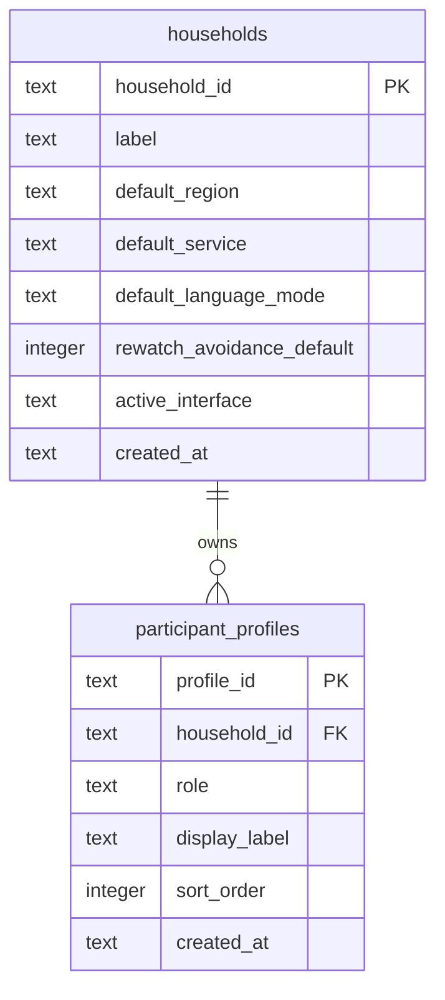

# Household Setup Schema

Slice 2 adds the first SQLite persistence tables for local household setup.
The schema stores only generic setup data and keeps real household names, ratings, notes, and watch history out of committed artifacts.

The default committed setup creates one `households` row labeled `Household`.
It creates exactly two `participant_profiles` rows labeled `Husband` and `Wife`.
The SQLite path is selected through the `MOVIE_NIGHT_MEDIATOR_SQLITE_PATH` environment variable, with a local development fallback of `data/movie_night_mediator.sqlite3`.
