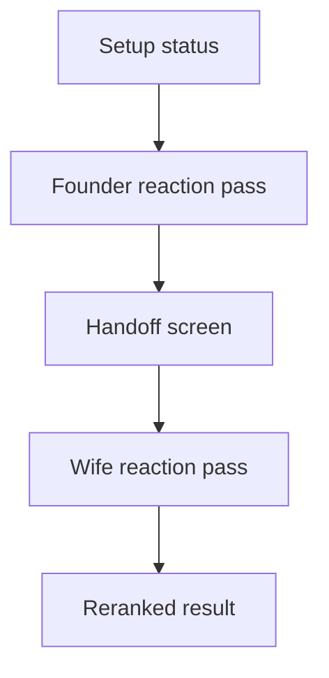

# Mobile Pass-The-Phone Wizard

## Purpose

The first mobile wizard slice makes the shared couple flow visible before live session wiring is complete.
It is meant for phone couch testing and agent review, not final recommendation quality.

## Current Flow

## UI Boundary

The page still loads setup state and API health through the existing server-side boundary.
The session shortlist uses local fixture data in `apps/web/app/session-fixtures.ts`.
The wizard state lives in `apps/web/app/pass-the-phone-wizard.tsx`.

This keeps the UI replaceable at the data edge.
When the backend session API is ready, the fixture provider can be replaced with calls for starting a session, recording reactions, and reading the reranked result.

## MVP Behavior

The UI shows the real MVP interaction shape.
The founder starts a shared session, reacts to five titles, hands the phone over, and the second participant reacts to the same five titles.
The result screen shows a best pick and the reranked shortlist.

The local reranker is intentionally simple.
It is only a demo bridge until the backend session and scoring services own the final ranking.

## Next Integration Point

The next frontend step is to replace fixture session state with API calls while preserving the screen flow.
The useful route set is expected to be:

- `POST /sessions`
- `GET /sessions/{session_id}`
- `POST /sessions/{session_id}/reactions`
- `POST /sessions/{session_id}/rerank`
