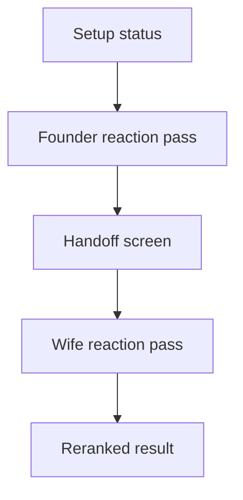

# Mobile Pass-The-Phone Wizard

## Purpose

The mobile wizard makes the shared couple flow visible for phone couch testing and agent review.
It uses backend recommendation and shared-session APIs when they are reachable, while preserving a local fixture path for offline review and recovery.

## Current Flow

## UI Boundary

The page still loads setup state and API health through the existing server-side boundary.
The session lifecycle loads each shortlist through the Next.js recommendation proxy and converts the response into UI candidate view models.
The five seed titles in `apps/web/app/session-fixtures.ts` are the fallback catalog when recommendation loading fails or the backend is unavailable.
The wizard composes the flow in `apps/web/app/pass-the-phone-wizard.tsx`, while pure reducers under `apps/web/app/pass-the-phone/` own flow and navigation transitions.
Focused hooks in that directory own onboarding and setup state, tonight-intent steering, history loading, and results persistence.
The session lifecycle module owns shortlist loading, shared-session synchronization, fallback recovery, reaction persistence, and handoff advancement through explicit state snapshots and output ports.
Browser interactions call `apps/web/app/session-client.ts`, which talks to focused Next route handlers under `apps/web/app/api/`.
Those handlers proxy to FastAPI through `API_BASE_URL` and avoid making the mobile UI depend on auth, deployment, or browser CORS setup.

This keeps the UI replaceable at the data edge and keeps the fixture data useful as seed and demo data.

## Demo Data Provenance

Local demo mode is fixture-backed.
It does not fetch live posters, live critic scores, live availability, or LLM-generated explanations.

The poster paths in `apps/web/app/session-fixtures.ts` are local demo assets.
They are kept so the accepted cinematic mobile flow can be reviewed without a live poster provider.

The critic score values in `apps/web/app/session-fixtures.ts` are hard-coded fixture values.
They are display confidence cues for the local demo and should not be treated as live Rotten Tomatoes, TMDb, Metacritic, or provider-sourced values.

Candidate view models expose field provenance through `CandidateViewModel.provenance`.
That model separates API payload values, local demo fixture values, local demo poster assets, generic fallbacks, and unavailable score data.
The provenance is code-facing for now so the main pass-the-phone flow does not feel like an internal test harness.

## MVP Behavior

The UI shows the real MVP interaction shape.
The founder starts a shared session, reacts to five titles, hands the phone over, and the second participant reacts to the same five titles.
The result screen shows a best pick and the reranked shortlist.

When the API path is active, the wizard loads recommendation candidates and creates a `POST /sessions` session from the returned five-title shortlist.
The first completed pass submits `POST /sessions/{session_id}/reactions`.
The handoff screen advances through `POST /sessions/{session_id}/advance-handoff`.
The second completed pass submits `POST /sessions/{session_id}/reactions` and uses the returned `rerankedSourceMovieIds` for result ordering.

The local reranker is still intentionally simple.
It is the fallback bridge when the backend is unreachable or rejects the local prototype session.

## Local Review States

The wizard shows whether the pass is in API mode or demo mode.
It also shows saving and loading states while session calls are in flight.
If the session API fails, the visible error is kept on screen and the flow continues in demo mode.

## Recommendation Integration Boundary

`apps/web/app/api/recommendations/shortlist/route.ts` selects the configured recommendation source and proxies shortlist requests to FastAPI.
`MOVIE_NIGHT_RECOMMENDATION_SOURCE=live_tmdb` enables the live candidate source; otherwise the backend uses its deterministic demo source.
The local fixture catalog remains recovery data and review support, not the primary connected-session shortlist.
Live critic-score integration remains a separate future concern.
