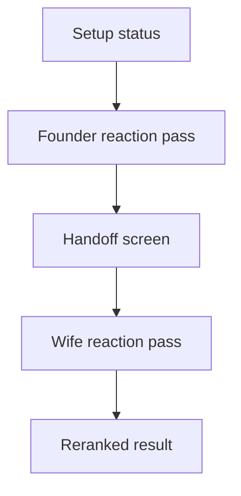

# Mobile Pass-The-Phone Wizard

## Purpose

The mobile wizard makes the shared couple flow visible for phone couch testing and agent review.
It now uses the backend shared session API when it is reachable, while preserving a local fixture path for offline review.

## Current Flow

## UI Boundary

The page still loads setup state and API health through the existing server-side boundary.
The session shortlist uses the five seed titles in `apps/web/app/session-fixtures.ts`.
The wizard state lives in `apps/web/app/pass-the-phone-wizard.tsx`.
Browser interactions call `apps/web/app/session-client.ts`, which talks to Next route handlers under `apps/web/app/api/session/`.
Those handlers proxy to FastAPI through `API_BASE_URL` and avoid making the mobile UI depend on auth, deployment, or browser CORS setup.

This keeps the UI replaceable at the data edge and keeps the fixture data useful as seed and demo data.

## MVP Behavior

The UI shows the real MVP interaction shape.
The founder starts a shared session, reacts to five titles, hands the phone over, and the second participant reacts to the same five titles.
The result screen shows a best pick and the reranked shortlist.

When the API path is active, the wizard creates a `POST /sessions` session from the five fixture shortlist items.
The first completed pass submits `POST /sessions/{session_id}/reactions`.
The handoff screen advances through `POST /sessions/{session_id}/advance-handoff`.
The second completed pass submits `POST /sessions/{session_id}/reactions` and uses the returned `rerankedSourceMovieIds` for result ordering.

The local reranker is still intentionally simple.
It is the fallback bridge when the backend is unreachable or rejects the local prototype session.

## Local Review States

The wizard shows whether the pass is in API mode or demo mode.
It also shows saving and loading states while session calls are in flight.
If the session API fails, the visible error is kept on screen and the flow continues in demo mode.

## Next Integration Point

The next frontend step is to replace the fixture shortlist with a recommendation candidate provider once that backend contract is available.
Until then, `apps/web/app/session-fixtures.ts` remains the stable seed list for local review and API session creation.
