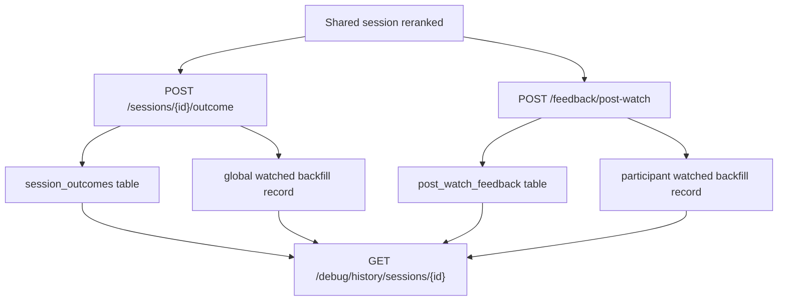

# Outcome, Feedback, and History Flow

This slice adds the first durable record of what actually happened after a shared recommendation session.
It separates "what we watched" from "how each person felt about it" so the product can learn without collapsing those signals together.

## Flow

## What each part means

- The outcome record captures the session-level result.
- It answers whether the couple watched the recommended title, watched something else, or watched nothing.
- The feedback record captures one person's reaction after watching.
- It answers whether that person loved it, thought it was fine, or did not like it.
- Global watched backfill says the household watched a title.
- Participant watched backfill says a specific person watched a title and may include taste signal.

## Current backend rules

- `watched_recommended` must match the session best pick.
- Any watched outcome writes a global watched-history record.
- Saving post-watch feedback writes a participant watched-history record when the session and outcome are known.
- `watched_nothing` does not create watched-history records.
- Debug history now returns `sessionOutcome` alongside reactions, reranked order, and post-watch feedback.

## Why this matters

This gives us the first reliable bridge from recommendation to learning.
The app can now distinguish a good shortlist from a good final outcome.
It also sets up the next UI slice cleanly, because the phone flow can post to explicit outcome and feedback endpoints instead of hiding that logic inside a later recommender rewrite.
