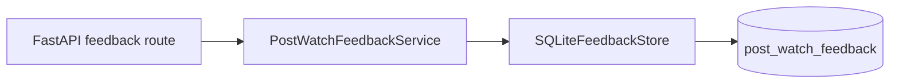

# Post-Watch Feedback Storage

Issue 10 stores post-watch feedback through a small service and SQLite store.
The route layer exposes a minimal save and list contract for the phone UI.

The service accepts a household id, session id, participant id, source movie id, feedback label, and optional note.
The stored feedback label is normalized to `loved`, `fine`, or `no`.
Blank household, session, participant, and title ids are rejected before a row is written.
Optional free-text notes are stored as raw text after trimming whitespace.

The table uses `(household_id, session_id, user_id, source_movie_id)` as its primary key.
Saving feedback for the same participant and title updates the existing record.
This keeps the MVP behavior forgiving when someone changes their mind after the first tap.

The domain model stays unchanged for now.
`PostWatchFeedback` remains the application-level feedback record.
The household id lives at the store boundary because listing feedback by household is a persistence concern.

The API uses `POST /feedback/post-watch` to save one record.
The API uses `GET /feedback/post-watch` to list feedback for a household, with optional `sessionId` filtering.
The response omits `householdId` because the household is the list boundary rather than part of the application feedback record.

Outcome capture and watched-history updates remain for the future API-facing Issue 10 slice.
This worker only implements the feedback capture route and does not decide whether a session outcome should automatically create watched-history records.
