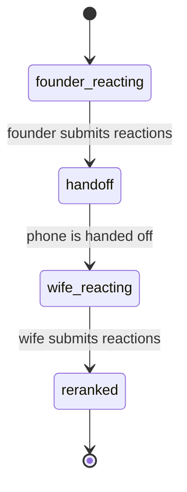

# Shared Session State Machine

Issue 8 adds the backend workflow for the pass-the-phone MVP.
The session API stores a five-title shortlist, two separate reaction passes, and the final reranked order.
It does not generate candidates, call TMDb, use an LLM, or render mobile UI.

## Flow

## API Shape

- `POST /sessions` starts a shared session after both participants have completed onboarding.
- `GET /sessions/{session_id}` loads the persisted session state.
- `PUT /sessions/{session_id}` updates the active session mode before reranking.
- `POST /sessions/{session_id}/reactions` stores the currently active participant pass.
- `POST /sessions/{session_id}/advance-handoff` moves from handoff into the second reaction pass.

## Learning Note

This state machine is the backend agreement the future phone wizard can trust.
The frontend does not need to guess what screen comes next.
It can read `state`, show the matching screen, and call the one endpoint that advances that state.
The first reranker is intentionally deterministic and local.
It scores Interested above Maybe, treats No as neutral, pushes Seen to the bottom, and preserves the original shortlist order as a tie breaker.
