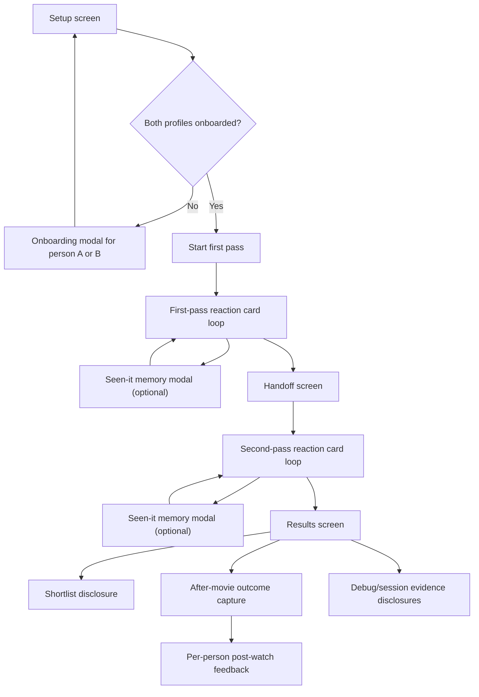

# Mobile Pass-the-Phone UX/UI Discovery Brief

## Scope

This is a bounded UX/UI discovery slice for the existing local mobile web MVP.
This brief does not propose code changes, framework changes, backend changes, auth changes, database changes, or deployment changes.
This brief is focused on the pass-the-phone mode only.
This brief is grounded in the current app structure in `apps/web/app/page.tsx`, `apps/web/app/pass-the-phone-wizard.tsx`, `apps/web/app/globals.css`, the existing architecture docs in `docs/architecture/`, and the current demo and API-backed content contracts in `session-fixtures.ts` and `session-client.ts`.

## What I Inspected

- The current root route in `apps/web/app/page.tsx`.
- The active mobile flow in `apps/web/app/pass-the-phone-wizard.tsx`.
- The visual system in `apps/web/app/globals.css`.
- The current demo candidate content in `apps/web/app/session-fixtures.ts`.
- The current API payload shape in `apps/web/app/session-client.ts`.
- The carried-over architecture docs in `docs/architecture/mobile-pass-the-phone-wizard.md` and `docs/architecture/household-setup-schema.md`.
- The current onboarding completion state through the local API routes.

## Compact Current Flow Map

The current product shape is a single-page wizard with modal overlays.
The main route renders one of five states in sequence.

## High-Level Diagnosis

The current product has the right functional backbone for MVP.
The biggest product issue is not missing capability.
The biggest issue is that multiple system concerns are still competing for the same small screen.

The app is trying to be five things at once on the main path.
It is a couple recommender.
It is an onboarding tool.
It is a session debugger.
It is a data review tool.
It is a design review surface with note-taking.

That makes the app feel more like a capable internal prototype than a calm consumer product.

## Flow Audit

### Flow 1 - First-time couple lands in the app

Current steps.
The user sees a date-based top bar, a five-step progress strip, a hero panel, summary tiles, setup or mode disclosures, and recent nights.
If onboarding is incomplete, the hero heading switches to setup language and the primary action opens a modal.

User goal.
Understand what this app is, whether it is ready tonight, and what the next tap should be.

Friction points.
The first screen asks the user to parse too many layers before acting.
The progress strip, summary tiles, backend status logic, mode options, and history all compete with the primary task.
The app currently uses hidden disclosures for settings and history, which is efficient for power users but still creates conceptual clutter because the summaries are visible and imply extra work.

Confusing labels.
`Setup`, `First pass`, `Handoff`, `Second pass`, and `Pick` are understandable, but they read like process language rather than user language.
`Adjust tonight's mode` is internal-feeling unless the user already understands what compromise versus founder-first means.
`Recent nights` is understandable, but it sits too close to the main task for first-time users.

Missing states.
There is no clear distinction between first-time onboarding, returning night-start, and recovery from a half-finished setup.
There is no separate welcome or explanation layer for the very first household use.
There is no compact "you are ready, continue where you left off" version for repeat use.

Visual and hierarchy issues.
The top area still looks like a system dashboard instead of a premium consumer app.
The hero orb is visually interesting but not meaningfully tied to the decision the user is making.
The screen has too many similar glass panels with similar radius, border, and depth, so nothing feels truly primary.

Severity.
High.

Recommendation.
Split this screen conceptually into only two startup states.
State one should be `Setup your tastes` for incomplete households.
State two should be `Start tonight's picks` for ready households.
Everything else should become secondary and either hidden behind a compact settings tray or moved after the main task.

Evidence.
`SetupStep` in `apps/web/app/pass-the-phone-wizard.tsx` renders onboarding, mode control, summary facts, and recent history all inside one panel.
`globals.css` gives nearly every section the same glass-card weight, which flattens hierarchy.

### Flow 2 - Onboarding modal

Current steps.
The user opens a full-screen-ish modal.
They must add one Loved, one Ok, and one No seed using suggestion chips or manual text entry.
They save and continue, then repeat for the second profile if needed.

User goal.
Finish taste setup quickly without feeling like they are doing data entry.

Friction points.
The bucket structure is sensible for the model but still reads like a form.
The copy explains the system more than it sells momentum.
Manual entry and suggested chips are mixed together in each bucket, which is flexible but visually busy.
There is no clear sense of completion beyond chip counts.

Confusing labels.
`Ok` is serviceable but emotionally vague.
`No` is clear, but `Loved / Ok / No` feels a bit dry for a consumer flow.
`Later` is risky because the entire flow is blocked by setup for first-time use.

Missing states.
There is no lightweight onboarding progress marker across both people.
There is no "we already know enough, finish later" path unless the backend requirement is relaxed.
There is no smart reassurance that setup is intentionally minimal.

Visual and hierarchy issues.
This modal is dense and chip-heavy.
Every bucket looks equally important, which makes the experience feel longer than it is.
The modal width and stacked cards will likely feel cramped on a phone once real data and manual entries accumulate.

Severity.
High.

Recommendation.
Keep the seed-bucket logic, but reframe the UI as a guided mini-flow with stronger progress and less visible chrome.
Use one person at a time with a progress header, simpler copy, and more emotional labels.
Consider `Love`, `Okay`, and `Avoid` or similar wording during the design phase, then validate against your taste-model vocabulary.

Evidence.
`OnboardingDialog` and `OnboardingBucket` in `apps/web/app/pass-the-phone-wizard.tsx`.

### Flow 3 - First pass reaction loop

Current steps.
One person sees one movie card at a time.
They can tap `Seen it`, then optionally choose a memory in a modal, then still rate the movie for tonight with `Interested`, `Maybe`, or `No`.
A back button exists below the reaction controls.

User goal.
Make a quick decision on whether this movie fits tonight.

Friction points.
This is the strongest existing flow structurally, but the card still makes the user work harder than necessary.
The card mixes metadata, generic explanation, cast chips, safe-pick label, and sometimes language access.
The result is visually fuller but not proportionally more helpful.
The current reason lines are often too generic to support an actual decision.

Confusing labels.
`Seen it` is now better than before because it opens a memory modal, but the relationship between the memory and the tonight-rating still needs stronger visual reinforcement.
`Interested`, `Maybe`, and `No` are correct for speed, but the screen should make it clearer that the tap immediately advances.

Missing states.
There is no expanded movie detail state for "tell me a bit more before I answer."
There is no explicit animation or transition language to make the loop feel premium and responsive.
There is no visible poster fallback treatment that feels deliberate when images fail.

Visual and hierarchy issues.
The poster area is large, but the information below it does not feel elegantly composed yet.
The title appears twice on the screen, once in the header and once in the card, which wastes valuable space.
The cast chips are a nice idea but currently read as generic pills rather than meaningful proof.
The glass treatment plus white buttons still feels like a prototype skin rather than a branded product.

Severity.
High.

Recommendation.
Keep the one-card-at-a-time flow.
Reduce duplicate title treatment.
Promote one truly useful detail line under the title.
Use a secondary expandable detail tray for fuller synopsis, cast, and availability confidence when needed.
Keep the reaction controls bold and low on the screen for thumb comfort.

Evidence.
`ReactionStep` in `apps/web/app/pass-the-phone-wizard.tsx`.
Your review notes about generic descriptions, poster crop feeling off, and the screen feeling cluttered.

### Flow 4 - Seen-it memory capture

Current steps.
The user taps `Seen it`.
A modal opens with `Loved it`, `Ok`, `Hated it`, or `I forget`.
After saving, the flow returns to the reaction card and the user is still expected to rate the movie for tonight.

User goal.
Record prior experience without losing the main task.

Friction points.
The current behavior is conceptually correct, but the causal chain is still not obvious enough from the main card.
If the user expects `Seen it` to be a direct reaction outcome, they can still misread the feature.

Confusing labels.
`Seen it` alone still carries the implication of skip-or-done.
The modal copy helps, but the entry point label may still be too short for first-time comprehension.

Missing states.
There is no lightweight inline confirmation that the memory was captured and the tonight-rating is still needed.
There is no option to revise the memory without reopening the same modal.

Visual and hierarchy issues.
The seen-memory banner is useful, but it still feels tacked on instead of integrated into the card’s primary decision model.

Severity.
Medium.

Recommendation.
Keep the current interaction model.
Improve the entry-point label and add stronger inline confirmation after save.
A possible direction is `Seen before` or `Seen before?` with a short helper line below the reactions during first-run onboarding only.

Evidence.
`SeenMemoryDialog` and the `reactionHint` copy in `ReactionStep`.
Your note that this previously felt like it did nothing.

### Flow 5 - Handoff

Current steps.
After the first person finishes, the app shows a handoff screen.
It summarizes first-pass counts and prompts the phone handoff.
The second person then starts their pass.

User goal.
Cleanly transfer the device without exposing the first person’s specific choices.

Friction points.
The step is functionally clear, but it is likely longer than necessary.
The stats are mildly interesting but not required for the core action.

Confusing labels.
None major.

Missing states.
There is no stronger privacy cue that the second person will not see the first person’s detailed picks.
There is no playful or satisfying transition to make the handoff feel intentional.

Visual and hierarchy issues.
The initials hero is clear but still reads like a placeholder motif rather than a polished transition scene.

Severity.
Medium.

Recommendation.
Keep the handoff step, but simplify it.
The main message should be one line, one privacy reassurance, and one obvious button.
Treat this screen more like an interstitial than a data panel.

Evidence.
`HandoffStep` in `apps/web/app/pass-the-phone-wizard.tsx`.

### Flow 6 - Second pass reaction loop

Current steps.
The second person sees the same card loop and reacts independently.

User goal.
Rate the same five titles without bias leakage.

Friction points.
This flow inherits the same strengths and weaknesses as the first pass.
If the first pass felt long or visually noisy, the second pass compounds that fatigue.

Confusing labels.
The current copy is fine.

Missing states.
There is no explicit framing that this pass is the last stretch before the answer.

Visual and hierarchy issues.
The app does not visibly escalate toward resolution.
The second pass visually feels the same as the first, when it could feel more anticipatory.

Severity.
Medium.

Recommendation.
Preserve parity with the first pass, but give the second pass slightly more momentum in its microcopy and progress treatment.

Evidence.
`ReactionStep` reused for `wife` in `PassThePhoneWizard`.

### Flow 7 - Results and shortlist

Current steps.
The results screen shows a best pick, a reason line, a shared score, each person’s reaction badge, an expandable reranked shortlist, after-movie capture, post-watch feedback, debug evidence, and restart.

User goal.
Decide what to watch tonight.

Friction points.
This screen does too much at once.
The best-pick moment should feel climactic and decisive, but it is quickly diluted by scoring language, accordion detail, outcomes, feedback collection, and debug utilities.
The shortlist exists, but it is still presented like a technical rerank rather than a nice browseable fallback list.

Confusing labels.
`Best pick` is clear.
`shared score` is internal and not necessarily useful to the couple.
`See the rest of the shortlist` is clearer than `Reranked shortlist`, but the inner content still reads operationally.
`Session evidence` is not consumer UI and should not sit in the main results surface in the final product path.

Missing states.
There is no prominent `Watch this now` or `Open where to watch` style action.
There is no richer fallback exploration behavior for titles two through five.
There is no lightweight “why this rose to the top” explanation in plain language.

Visual and hierarchy issues.
The winner card is better than the old debug-heavy state, but it still lacks premium tension and payoff.
The shortlist items are text-heavy and visually similar.
The post-watch capture belongs to a later moment and visually muddies the payoff screen.

Severity.
High.

Recommendation.
Treat results as two layers.
Layer one is the immediate answer for tonight.
Layer two is optional fallback browsing.
Move debug evidence fully out of the consumer path.
Consider moving after-movie capture into a later return flow rather than the instant decision moment.

Evidence.
`ResultsStep` and `DebugHistoryPanel` in `apps/web/app/pass-the-phone-wizard.tsx`.

### Flow 8 - History, review notes, and debug surfaces

Current steps.
Setup exposes recent nights.
Results exposes debug history.
A persistent floating review-notes widget can be opened on top of the app.

User goal.
For the founder, inspect prior behavior and leave review feedback.
For the normal couple flow, mostly ignore this.

Friction points.
These surfaces are useful for product development but degrade the consumer feeling of the app when they remain visible in the main experience.

Confusing labels.
`Session evidence` and `Debug history` are engineering language.

Missing states.
There is no clear split between founder review mode and normal couple mode.

Visual and hierarchy issues.
The floating review widget and debug disclosures make the UI feel like a testing build.

Severity.
Medium for prototype work.
High for perceived polish.

Recommendation.
Keep these tools for founder use, but put them behind a deliberate review mode or separate diagnostics entry point later.

Evidence.
`RecentSessionsPanel`, `DebugHistoryPanel`, and `ReviewNotesWidget`.

## Top 3 UX Problems

1. The startup screen is trying to do onboarding, tonight setup, history, session mode selection, and system messaging at the same time.
2. The reaction card contains more information than it currently earns, while still not surfacing the most decision-helpful details elegantly.
3. The results screen blends the emotional payoff moment with logging, feedback capture, and technical evidence.

## Top 3 Visual Problems

1. Too many panels share the same glass-card treatment, so hierarchy collapses and the screen feels uniformly heavy.
2. The current dark-glass system reads like a polished prototype rather than a finished consumer product.
3. Decorative motifs exist, but they do not yet feel meaningfully tied to the movie-night decision or to a coherent brand language.

## Content and Data Notes That Affect UX

The current demo data is directionally useful but still too generic in the `reason` field.
The UI now exposes cast and better title data, which helps, but the app still needs higher-signal microcontent if it wants people to decide confidently.
Useful candidate-detail fields for this product are likely one stronger synopsis line, top cast, release year, runtime, confidence around language access, and a plain-language fit reason.
The current setup already supports some of this structure through `ShortlistCandidatePayload`, which includes `whyShort`, `fitBucket`, provider data, and scoring fields, even though the current UI does not yet use those fields richly.

## Visual Direction Lanes

### Lane A - Premium Cinema Utility

What it is.
A restrained premium streaming-product look.
Think black stage, strong typography, crisp spacing, polished poster treatment, minimal neon, and very deliberate hierarchy.

Attributes.
High contrast.
Large confident type.
Real poster art as the hero texture.
Sparse chrome.
Very few colors on screen at once.
Clear bottom-anchored actions.

Why it fits.
It makes the app feel commercial without requiring an entire brand universe.
It respects the practical couch use case.
It keeps focus on choice rather than on visual novelty.

Risks.
If done too plain, it can drift into generic streaming-clone territory.

Recommendation.
This should be the primary lane.

### Lane B - Soft Neon Night

What it is.
A more cyberpunk-adjacent mood, but disciplined.
Dark base, subtle neon edges, atmospheric gradients, and motion accents used mainly for progression and focus.

Attributes.
Blue-magenta-cyan accents used sparingly.
Shimmer or pulse reserved for progress and state transitions.
Soft glows on hero objects, not on every control.
Poster cards remain readable and mostly neutral.

Why it fits.
It preserves the fun of the direction you asked for.
It can make the app feel special on the couch at night.

Risks.
It can quickly become “design student cyberpunk” if every card, border, and button glows.
Readability and trust drop fast when this lane is over-applied.

Recommendation.
This is the best alternative lane.
Use it as seasoning on top of Lane A, not as the whole meal.

### Lane C - Editorial Movie Journal

What it is.
A more curated and taste-forward direction.
Less sci-fi.
More elegant typography, muted image framing, and review-like presentation.

Attributes.
Poster-led layout.
Refined serif or serif-accent moments.
Quiet supporting copy.
High information density, but with editorial pacing.

Why it fits.
It could make the recommendation feel thoughtful and cultured rather than gadgety.

Risks.
It may underplay the fast pass-the-phone mechanic.
It also risks feeling too boutique for an everyday quick-decision tool.

Recommendation.
Good for a later exploration.
Not my first MVP direction.

### Lane D - Glassy Ops Dashboard

What it is.
The current family of direction, pushed further.

Attributes.
Lots of frosted panels.
Outlined pills.
Status strips.
Dashboard-like disclosures.

Why it fits.
It is easy to build incrementally from where the app already is.

Risks.
It will continue to feel like an internal tool.
It works against the emotional goal of “we found tonight’s movie.”

Recommendation.
Avoid as the primary design lane.

## Reference Strategy

I could not reliably pull live commercial inspiration sets into this brief from inside the current environment, so I am not going to fake web research.
The safest way to use references next is as a founder-approved browse pack with explicit targets.

Use these manual browse targets.
- Mobbin.
- Page Flows.
- Refero.
- Pttrns.
- Hypelist for motion-heavy dark mobile inspiration.

Use search terms like these.
- `streaming mobile dark detail page premium`.
- `movie recommendation app mobile onboarding`.
- `music swipe mobile dark polished`.
- `cinema app mobile results card`.
- `premium mobile glass dark readability`.
- `cyberpunk mobile ui readable dark`.

The image you attached points toward a useful sub-reference.
It suggests a black stage, centered luminous hero object, very low copy density, and a strong sense of visual patience.
That reference is most useful for transitions, loading, and interstitial moments.
It is less useful as a literal template for the whole app because the app still needs dense decision controls.

## Decisions To Make Before Major UI Implementation

These are the decisions I would want explicit yes or no answers to before a large redesign pass.

1. Yes or no to a dedicated first-time welcome state separate from returning-night setup.
2. Yes or no to hiding `Recent nights` by default on the startup screen.
3. Yes or no to removing API and debug language entirely from the normal user path.
4. Yes or no to treating `session mode` as an advanced setting rather than a front-stage choice.
5. Yes or no to keeping onboarding as a modal versus turning it into a full-screen mini-flow.
6. Yes or no to adding a compact “More details” expansion on each reaction card.
7. Yes or no to moving post-watch outcome capture out of the immediate results moment.
8. Yes or no to keeping the persistent review-note widget visible in normal founder testing mode.
9. Yes or no to a hybrid visual lane where Premium Cinema Utility is the base and Soft Neon Night is the accent system.

## Pick-This-If Guide

Pick Lane A if the main goal is “feel like a real paid consumer app quickly.”
Pick Lane B if the main goal is “keep the nighttime mood and make it feel more special.”
Pick Lane C if the main goal is “feel more curated and taste-led than mainstream streaming.”
Avoid Lane D if the goal is to stop the app feeling like a smart internal prototype.

## Recommended Direction

My recommendation is a hybrid.
Use Premium Cinema Utility as the structural system.
Use Soft Neon Night only for selective moments like loading, handoff, progress shimmer, and maybe a hero transition on the results reveal.

That gets you the professionalism you want without flattening the personality.
It also leaves room for later Lavish iterations that target specific screens instead of recoloring the entire app indiscriminately.

## First Future UI Slice To Design and Implement

The first future slice should be the startup and onboarding front door only.
Do not touch the whole app at once.

The slice should cover:
- returning-ready household startup,
- first-time blocked-by-onboarding startup,
- onboarding progress for both people,
- and the transition into the first reaction card.

Why this slice first.
This is where the app currently makes its first and strongest “prototype versus product” impression.
This is also where product clarity, hierarchy, and brand direction can be established once and then echoed through the rest of the flow.

## Future Slices After That

Slice 2 should be the reaction card system.
Slice 3 should be the results and shortlist system.
Slice 4 should be founder-only review and debug surfaces.

## Plain-English Summary

What I found.
The product backbone is in decent shape.
The core pass-the-phone flow is real and coherent.
The app feels clunky mostly because too many secondary concerns are still on the main stage.

Top 3 UX problems.
The startup screen is overloaded.
The reaction card still makes users scan too much.
The results screen mixes the payoff moment with system and logging concerns.

Top 3 visual problems.
The hierarchy is too flat.
The glass-card language is overused.
The current dark theme feels more like a polished prototype than a consumer app.

Visual direction options.
My recommended base lane is Premium Cinema Utility.
My recommended accent lane is Soft Neon Night.
Editorial Movie Journal is a valid alternate experiment.
Glassy Ops Dashboard should not be the target finish line.

What decision is needed next.
We should align on the primary visual lane and on whether we want the startup experience split into a first-time setup state and a returning-night state before any major UI implementation pass begins.
