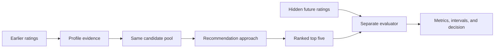

# Recommendation Evaluation At WatchSignal

WatchSignal treats recommendation quality as an engineering claim that needs evidence, not as a subjective assertion that a new model "feels smarter."
The project is building a leakage-resistant offline recommender-system evaluation framework around MovieLens 32M, followed by a real household acceptance gate.

## The Evaluation Question

Given only a user's earlier ratings, can a recommendation approach place movies that user later rated highly near the top of a five-item shortlist while avoiding known dislikes?

The recommendation engine receives profile history and candidate movies.
It does not receive the held-out future ratings.
A separate evaluator reveals those ratings only after ranking and compares the result with the user's ideal ordering.

## Why The Protocol Is Serious

- Chronological holdouts model future preference rather than randomly hiding ratings from the same moment.
- Exploration, validation, and sealed users have deterministic manifests and zero cross-role overlap.
- A model is designed on exploration data, selected on validation data, and judged once on sealed data.
- Popularity, V1, V2, collaborative, and hybrid approaches receive comparable evidence.
- NDCG@5 and pairwise preference accuracy measure ranking quality.
- Known-dislike rate@5 protects against a model that gains average relevance by surfacing more obvious failures.
- Per-user bootstrap intervals and a predeclared two-point target distinguish repeatable gains from sampling noise.
- Feature-family ablations test whether cast, crew, tags, genres, and related metadata contribute incremental value.
- Offline evidence is followed by household review because MovieLens cannot model couple negotiation, tonight intent, availability, or trust.

## Current Evidence

The completed MovieLens 32M census covers 200,948 users and 32,000,204 ratings.
It identified 14,617 analysis-ready established users under the strict one-year protocol.
The founder-approved lock assigns 4,617 to exploration, 5,000 to validation, and 5,000 to the sealed benchmark.
The manifests are local and label-free, while committed SHA-256 checksums make their exact membership reproducible without publishing MovieLens user identifiers.
The first exploration-user tracer has also passed: V1 and V2 received the same fingerprinted request, future ratings were joined only after scoring, and deliberate leakage, candidate-drift, and sealed-access violations all failed as designed.
The cohort baseline now covers 14,077 exploration and validation user-cohort evaluations with per-user metrics and 1,000-resample confidence intervals.
Popularity substantially beats both heuristics, while V2 is slightly worse than V1 on established-user NDCG@5 and neither heuristic converts 500 ratings into better rankings than 100 ratings.
The first ratings-only collaborative model now learns 16-dimensional movie factors from 1,268,600 authorized profile ratings.
It beats popularity by 2.28 NDCG points on validation deep-history users, with a confidence interval entirely above zero, but has not established a broad win for established or cold-start users.
The first content-collaborative hybrid adds a fixed 285-column genre, era, and tag snapshot.
It produces small repeatable overall gains over collaborative and a 4.65-point validation gain on the declared deep-history sparse-item subgroup, while preserving separate contribution evidence for ablation.
Controlled retraining retained genre, era, and tags because each contributes to at least one locked primary metric, then froze the full-hybrid checksum before sealed access.
The sealed benchmark then evaluated that one preselected artifact exactly once against popularity, V1, V2, collaborative, and safety/coverage gates.
The selected hybrid beat the strongest comparator, the ratings-only collaborative model, by 0.005553 NDCG@5 with a 95% interval from 0.003863 to 0.007349.
It also improved pairwise preference accuracy and reduced known-dislike rate.
However, the NDCG gain was only about 28% of the predeclared 0.02 minimum useful improvement, so the automated recommendation is **hold** rather than product promotion.

This currently proves that the dataset, protected manifests, end-to-end evaluation boundary, and current baseline performance are reproducible.
It also proves that the current hybrid produces a statistically credible sealed-ranking improvement over the strongest offline comparator.
It does not prove that the improvement is large enough to justify changing the product default, and it does not prove household success.
The founder decision for Issue 126 is **promote to reversible product integration**, not unconditional default promotion.
The hybrid earned integration because it substantially beats the current V2 heuristic on the measured individual-ranking task and has the highest overall sealed NDCG@5.
Its incremental gain over collaborative remains below the locked practical-effect threshold, so Issue 127 must compare complete household paths before any default change.
The [founder decision addendum](validation/movielens-founder-decision-addendum.md) preserves the original failed gate and documents why reversible integration is a separate product decision rather than a post-hoc protocol change.

The completed second discovery round preserves that history rather than rewriting it.
It repartitioned the retired established users into development fit, tune, and one shared internal test under a new two-gate protocol.
Gate one asks whether a learned model materially beats deployed V2.
Gate two asks whether a challenger earns preference over hybrid through either a 0.02 quality gain or near-equal quality with at least one measured 25% cost improvement.

The support-aware search selected hybrid shrinkage `80`, while the bounded 12-candidate collaborative search selected a 16-dimension explicit-ALS model with regularization `2.0` and five iterations.
Preference-weighted squared-error candidates did not win.
On the 2,924-user internal test, the collaborative challenger scored `0.626508` NDCG@5 versus hybrid at `0.626059` and V2 at `0.451398`.
Collaborative minus hybrid was `+0.000449`, with a paired 95% interval from `-0.002967` to `0.003682`.
That failed the quality route but passed the locked simplicity route because quality was non-inferior, artifact size fell `78.6%`, fit time fell `43.5%`, scoring time fell `32.6%`, and the fixed content-snapshot dependency disappeared.

The frozen challenger then ran exactly once on a replacement panel of 5,000 previously unused users.
The panel retained the 100-history and 30-future task but used a disjoint 30-to-364-day activity-span contract and excluded every prior manifest member.
On this panel, collaborative scored `0.615832` NDCG@5, hybrid scored `0.615439`, and V2 scored `0.437816`.
Collaborative minus V2 was `+0.178017`, with a paired 95% interval from `0.171070` to `0.184620`.
Collaborative minus hybrid was `+0.000393`, with a paired 95% interval from `-0.001928` to `0.002588`.
The challenger again passed every eligibility and simplicity gate while failing the separate 0.02 quality route.
The evidence-backed decision is therefore to promote the regularization-2.0 collaborative model as the offline individual-taste champion, not to claim that it is substantially more accurate than hybrid.
It wins because measured ranking quality is equivalent while compute, artifact, and dependency costs are materially lower.
The founder explicitly ratified this surfaced decision after reviewing the completed replacement-sealed result.
The product default remains V2 pending valid household evidence.

## Model Ladder And What Was Learned

The benchmark contains five approaches with different ownership and learning behavior.

| Approach | What it is | Uses V1 or V2 internally? | Role |
| --- | --- | --- | --- |
| Popularity | One non-personalized ranking learned from exploration rating frequency | No | Serious control baseline |
| V1 | Hand-authored genre-oriented product heuristic | Not applicable | Existing heuristic baseline |
| V2 | Expanded hand-authored product heuristic with additional metadata scoring | Builds on the product heuristic lineage | Existing heuristic challenger |
| Collaborative | Explicit-feedback alternating-least-squares model trained from MovieLens ratings | No | Ratings-only learned baseline built from scratch |
| Hybrid | Collaborative factors blended with content-predicted factors from genre, era, and tags | No | Learned content-collaborative challenger |

V1 scores 0.450406 versus V2 at 0.449374 on validation-established NDCG@5, and the paired interval indicates a small repeatable V2 regression there.
On sealed-established users, V2 scores 0.452318 versus V1 at 0.452043, a negligible reversal that does not establish V2 superiority.
The mature conclusion is not that V1 is universally better.
It is that V2 has not earned an improvement claim and both heuristics trail popularity, collaborative, and hybrid by a large margin on this offline task.

The collaborative model is the from-scratch learned model in this experiment.
It learns latent movie relationships directly from ratings without consulting V1 or V2.
The hybrid is also independent of V1 and V2, but it starts from the collaborative factors and adds genre, era, and tag evidence.

## Sealed Inventory And Future Learning

The first sealed panel is fully spent as independent evidence, not destroyed as usable data.
Its 5,000 established-user outcomes were opened for the one-time benchmark, so they may now inform analysis or later training but cannot honestly serve as an untouched final test again.

Under the exact locked established protocol, there is no second hidden sealed panel.
The census found 14,617 analysis-ready established users, and all were assigned: 4,617 exploration, 5,000 validation, and 5,000 sealed.
MovieLens 32M contains many additional users, but constructing another panel from them would require a newly declared protocol because they failed at least one current condition such as the full one-year window, both-label requirement, or complete mapping.
A replacement protocol was subsequently declared before membership generation.
It found 9,706 eligible disjoint users, selected 5,000 deterministically, locked the manifest checksum, and completed one frozen evaluation without a resume.
That replacement panel is now also spent.

Future model work may use all retired MovieLens results for development, but it must not call either opened panel sealed again.
A new final claim requires a fresh disjoint population, a newer dataset, or newly collected WatchSignal evidence.
Richer cast, director, writer, language, keyword, and production features remain a valid next research slice only after their source, licensing, coverage, and leakage contracts are fixed.
The collaborative champion remains the baseline to beat, while hybrid remains the complexity comparator and V2 remains the deployed control.

## Engineering Progression

1. Profile MovieLens 32M and establish feasible cohort sizes.
2. Lock metrics, chronology, power target, manifests, and sealed-data rules.
3. Trace one user end to end and deliberately prove leakage and candidate-parity guards fail when violated.
4. Publish popularity, V1, and V2 baselines over the full eligible cohorts.
5. Train a ratings-only collaborative baseline.
6. Train a hybrid content-collaborative model.
7. Remove feature families and retrain to measure their incremental contribution.
8. Select one artifact on validation data and evaluate it once on sealed future ratings.
9. Lock a second development protocol and compare bounded hybrid and collaborative challengers.
10. Select one internal winner through quality or simplicity gates.
11. Generate a checksum-locked replacement panel from previously unused users.
12. Spend that panel exactly once and promote the collaborative challenger as offline champion through the simplicity route.
13. Integrate the exact champion artifact behind a reversible product adapter.
14. Test whether the offline result survives real household use before changing the default.

## Portfolio Language

Current accurate description:

> Designed and implemented a leakage-resistant recommender evaluation and model-selection system over MovieLens 32M, including chronological holdouts, deterministic disjoint manifests, popularity and heuristic controls, explicit-ALS collaborative and content-hybrid models, NDCG@5, pairwise accuracy, dislike and coverage guardrails, paired bootstrap intervals, bounded hyperparameter search, reproducible artifact checksums, quality and simplicity gates, and two one-time sealed evaluations; selected a collaborative model that matched hybrid ranking quality while reducing artifact size by 78.6% and scoring time by 35.5% on a 5,000-user replacement panel.

Target description after household validation, only if supported by future evidence:

> Designed and implemented a leakage-resistant offline evaluation framework for a hybrid movie recommender using MovieLens 32M, chronological cohorts, popularity and heuristic baselines, NDCG@5, pairwise accuracy, safety metrics, bootstrap confidence intervals, power analysis, feature-family ablations, and sealed holdouts; paired offline evidence with household validation.

## Evidence

- Protocol decision: [MovieLens benchmark protocol](validation/movielens-benchmark-protocol.md).
- Dataset census: [MovieLens 32M census](validation/movielens-32m-census.md).
- Machine-readable lock: [Protocol checksum record](validation/movielens-protocol-lock.json).
- One-user evidence loop: [Chronological tracer bullet](validation/movielens-one-user-trace.md).
- Cohort baseline evidence: [MovieLens cohort baselines](validation/movielens-cohort-baselines.md).
- Ratings-only learned baseline: [Collaborative baseline](validation/movielens-collaborative-baseline.md).
- Content-collaborative baseline: [Hybrid baseline](validation/movielens-hybrid-baseline.md).
- Validation model selection: [Feature ablation and selection](validation/movielens-model-selection.md).
- Sealed benchmark packet: [Sealed benchmark](validation/movielens-sealed-benchmark.md).
- Model-improvement protocol: [Two-gate development protocol](validation/model-improvement-development-protocol.md).
- Support-aware hybrid search: [Support-aware hybrid](validation/movielens-support-aware-hybrid.md).
- Collaborative candidate search: [Collaborative search](validation/movielens-collaborative-search.md).
- Internal winner packet: [Internal winner](validation/movielens-internal-winner.md).
- Replacement-panel lock: [Replacement lock](validation/replacement-sealed-panel-lock.json).
- Replacement sealed result: [Replacement benchmark](validation/movielens-replacement-sealed-benchmark.md).
- Implementation plan: [Recommendation Learning Lab issues](issues/recommendation-learning-lab-issue-breakdown.md).
