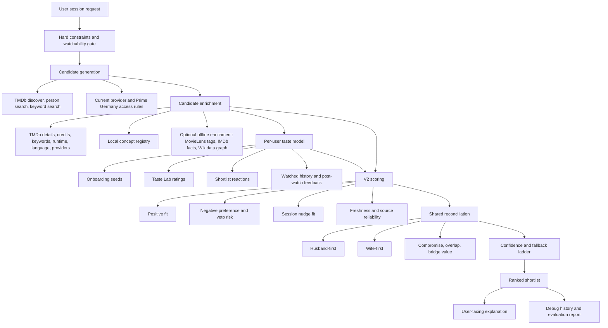

# Scoring V2 Data Research Spike

Status: complete for Phase 3 planning.

Phase tracker:

```text
Scoring V2: [####################] 14/14 issues done
```

## Purpose

This spike identifies the richest practical data WatchSignal can use for the V2 recommendation engine.
It intentionally looks beyond the fields V1 already uses.
It also looks beyond TMDb so the product does not become accidentally constrained by the current integration.

## Founder-Readable Recommendation

Build V2 as a concept-centered hybrid recommender.
Keep TMDb as the primary runtime provider for now.
Use the app's own Taste Lab, watch history, post-watch feedback, shortlist reactions, and session nudges as the personal taste layer.
Add a canonical concept registry between raw metadata and scoring so TMDb genres, TMDb keywords, MovieLens tags, user dislikes, and explanation text can all speak the same stable vocabulary.
Prototype external enrichment with MovieLens Tag Genome first because it is directly relevant to movie taste concepts.
Evaluate IMDb and Wikidata as optional offline enrichment sources, not as immediate runtime dependencies.
Do not promote a collaborative-filtering or embedding-heavy model until WatchSignal has enough first-party household behavior to justify it.

## Whole-Recommender Alignment

V2 is not a nudge-parser upgrade.
It is a whole recommender upgrade.
The nudge contract is only one input into the scorer.
The larger change is that WatchSignal should enrich both sides of the recommendation match:

- Enrich the profile with concepts learned from onboarding seeds, Taste Lab ratings, watched history, shortlist reactions, post-watch feedback, source reliability, and recency.
- Enrich each candidate with canonical concepts from TMDb metadata, credits, keywords, overview text, runtime, language, provider access, local feature tags, and optional offline datasets.
- Score the fit between enriched profiles and enriched candidates using positive fit, negative fit, veto risk, overlap, bridge value, confidence, and fallback behavior.

The first V2 implementation should therefore prove the concept vocabulary and evidence contract before it changes ranking weights.
Later slices should make profile enrichment and household reconciliation materially smarter than genre scoring.
The architecture diagram is also available as standalone local artifacts:

- [docs/scoring-v2-recommender-architecture.svg](scoring-v2-recommender-architecture.svg)
- [docs/scoring-v2-recommender-architecture.html](scoring-v2-recommender-architecture.html)

## Best V2 Recommender Shape



## Research Takeaways

Hybrid recommenders are the right family for WatchSignal V2.
The useful pattern is not "pick one algorithm forever."
It is to combine content metadata, first-party user behavior, contextual session intent, and group reconciliation in a testable way.
The systematic review of hybrid recommender systems describes hybridization as combining multiple recommendation strategies to benefit from their complementary advantages, especially around cold start and sparse data.
Source: [Hybrid Recommender Systems: A Systematic Literature Review](https://arxiv.org/abs/1901.03888).

Offline evaluation is useful but incomplete.
It should be used to compare known scenarios and regression behavior, not as the only product truth.
Research comparing offline and online evaluation found that offline metrics vary widely and do not cleanly replace online/user evaluation.
Source: [Off-line vs. On-line Evaluation of Recommender Systems in Small E-commerce](https://arxiv.org/abs/1809.03186).

Recommendation evaluation should include usefulness, trust, discovery, and exploration, not only predicted rating accuracy.
One evaluation protocol paper argues that recommenders serve several functions, including helping users decide, compare, discover, and explore.
It also reports that RMSE does not cleanly correlate with recommendation quality.
Source: [Toward a New Protocol to Evaluate Recommender Systems](https://arxiv.org/abs/1209.1983).

Explainability needs its own evaluation.
An explainable recommendation survey emphasizes that explanations can affect transparency, trust, satisfaction, and persuasiveness, but explanation quality must be evaluated deliberately.
Source: [Measuring "Why" in Recommender Systems](https://arxiv.org/abs/2202.06466).

Trustworthy recommendation matters because recommender systems can create risks around transparency, privacy, controllability, robustness, and fairness.
WatchSignal should keep the scorer inspectable and user-controllable rather than becoming an opaque LLM ranker.
Source: [A Survey on Trustworthy Recommender Systems](https://arxiv.org/abs/2207.12515).

Group recommendation research supports the current V2 direction.
Known group-ranking semantics include least misery and aggregate voting.
That maps well to WatchSignal's compromise mode, veto risk, and bridge-value goals.
Source: [From Group Recommendations to Group Formation](https://arxiv.org/abs/1503.03753).

## Current Local Data Inventory

### Already Used By V1

- Household defaults: region, Prime Video service, language posture, rewatch avoidance.
- Session context: audience mode, session mode, viewer order, mood text, genre hint, service constraint, language constraint, rewatch permission, person constraints.
- User profile: onboarding seeds, Taste Lab-derived profile evidence, subtitle intolerance, horror exclusion.
- Candidate metadata: title, source id, media type, release year, runtime, genres, overview, top cast, provider names, provider access, original language, spoken languages, watched status, safety status, interesting-safe-pick marker, enrichment feature scores, matched person names.
- Session reactions: Interested, Maybe, No, Seen.
- Scoring evidence: contribution family, label, value, enrichment status.
- Snapshot evidence: candidate inputs, ranked candidates, user scores, hard-filter status, uncertainty, follow-up, enrichment coverage.

### Available But Underused

- Runtime can become a pacing and weeknight-fit signal.
- Release year can become decade, recency, nostalgia, or comfort-food evidence.
- Overview can feed theme extraction beyond token overlap.
- Top cast can become person affinity, repeated-collaborator signal, and actor-driven explanation.
- Provider access types can support "included vs rent vs buy" explanation while preserving the Prime Germany eligibility rule.
- Original language and spoken languages can support subtitle-risk explanations without turning language into a hidden penalty.
- Matched person names can distinguish actor-driven retrieval from generic action or genre ranking.
- Enrichment coverage can become a confidence input, not just a debug note.
- Taste Lab familiarity can distinguish "haven't seen" from "neutral."
- Taste memory event type can weight post-watch feedback above lightweight reactions.
- Debug snapshots can become the backbone of before-and-after scorer evaluation.

## Current TMDb Inventory

### Already Integrated

- Discover movie search.
- Watch provider filtering.
- Prime Germany flatrate, rent, and buy monetization posture.
- Movie details.
- Credits appended to details in the general discover path.
- Person search.
- Person movie credits.
- Keyword search.
- Watch providers by movie.
- Poster URLs.

Sources:

- [TMDb movie details](https://developer.themoviedb.org/reference/movie-details).
- [TMDb movie credits](https://developer.themoviedb.org/reference/movie-credits).
- [TMDb movie watch providers](https://developer.themoviedb.org/reference/movie-watch-providers).

### Promising TMDb Fields Or Endpoints To Evaluate

- Keywords by movie for canonical concepts.
- External ids for linking TMDb to IMDb, Wikidata, and MovieLens mappings.
- Release dates and certification data for region-aware maturity and content caution.
- Similar movies and recommendations as candidate-generation hints, not ranking authority.
- Collections for franchise and series adjacency.
- Videos or trailers only as optional explanation or UI enrichment, not scoring-critical.
- Translations and alternative titles for language and household accessibility.
- Reviews should be treated carefully because they add noise, latency, and potential licensing or tone-extraction ambiguity.

### TMDb Constraints

TMDb remains the best runtime source because it already serves the product's posters, details, credits, and watch-provider access.
The watch-provider endpoint is powered by JustWatch and requires attribution.
The V2 plan should preserve the current attribution and availability posture.
TMDb append-to-response can reduce round trips, but any broader append set should be latency-tested before it affects couch flow.

## Non-TMDb Source Comparison

| Source | Best use | Strength | Risk | Recommendation |
|---|---|---|---|---|
| MovieLens ratings | Offline evaluation and collaborative baselines | Research-standard movie ratings | Not WatchSignal-specific users | Use for evaluation ideas, not runtime personalization yet |
| MovieLens Tag Genome | Concept/tag enrichment | 10.5 million tag-movie relevance scores across 1,084 tags | Large 1.8 GB dataset and license handling | Prototype as local offline enrichment after founder approval |
| IMDb non-commercial datasets | Title, runtime, genres, crew, principals, ratings, identifiers | Daily refreshed TSVs and rich people/title structure | Non-commercial terms and local data handling | Evaluate as offline enrichment only |
| Wikidata | Open knowledge graph and external identifiers | Open CC0-style graph with SPARQL and API access | Data quality varies and matching can be messy | Prototype for identifiers, franchises, awards, cultural facts |
| DBpedia | Extracted Wikipedia graph | Structured RDF source | Less direct movie-product fit than Wikidata | Defer unless Wikidata is insufficient |
| OMDb | Simple title facts and ratings bridge | Easy API shape | API key, third-party reliability, possible paid usage | Defer until a specific gap appears |
| Commercial availability providers | Better streaming availability | Potentially more precise provider access | Paid vendor and contract decision | Founder approval required |
| LLM enrichment | Text clustering and concept extraction | Helpful for notes and overview interpretation | Cost, latency, opacity, drift | Use only to compile structured concepts, not final ranking authority |

Sources:

- [MovieLens datasets](https://grouplens.org/datasets/movielens/).
- [MovieLens Tag Genome 2021](https://grouplens.org/datasets/movielens/tag-genome-2021/).
- [IMDb non-commercial datasets](https://developer.imdb.com/non-commercial-datasets/).
- [Wikidata data access](https://www.wikidata.org/wiki/Wikidata:Data_access).

## Signal Classification

| Signal | Role | Value | Latency risk | Cacheability | Explainability | Testability | V2 posture |
|---|---|---:|---:|---:|---:|---:|---|
| Watchability status | Eligibility | High | Low | High | High | High | Keep upstream of scoring |
| Provider access | Eligibility and explanation | High | Medium | Medium | High | High | Preserve Prime Germany rule |
| Genres | Scoring | Medium | Low | High | High | High | Use, but stop over-weighting |
| Keywords | Concept enrichment | High | Medium | High | Medium | High | Add to concept registry |
| Overview themes | Concept enrichment | High | Low | High | Medium | Medium | Use deterministic first, LLM later if needed |
| Cast | Retrieval and scoring | High | Medium | High | High | High | Use for actor affinity and explanations |
| Crew | Scoring | Medium | Medium | High | Medium | Medium | Add after cast and concepts |
| Runtime | Scoring and explanation | Medium | Low | High | High | High | Use for pacing and weeknight fit |
| Release year | Scoring and explanation | Medium | Low | High | High | High | Use for decade and recency signals |
| Original language | Eligibility and explanation | Medium | Low | High | High | High | Use carefully, avoid hidden penalty |
| Spoken languages | Eligibility and explanation | Medium | Low | High | High | Medium | Use where reliable |
| Taste Lab rating | User affinity | High | Low | High | High | High | Strong personal signal |
| Taste Lab familiarity | Familiarity and rewatch handling | Medium | Low | High | High | High | Distinguish neutral from unseen |
| Shortlist reaction | Session memory | Medium | Low | High | High | High | Lightweight signal |
| Post-watch feedback | User affinity | Very high | Low | High | High | High | Strongest first-party signal |
| Watched history | Eligibility and negative familiarity | High | Low | High | High | High | Keep separate from taste dislike |
| Debug snapshot | Evaluation | High | Low | High | High | High | Extend for V2 evidence |
| MovieLens tags | Offline enrichment | High | Low at runtime if precomputed | High | Medium | High | Prototype next |
| IMDb facts | Offline enrichment | Medium | Low at runtime if local | High | Medium | Medium | Evaluate terms first |
| Wikidata graph | Offline enrichment | Medium | Medium | Medium | Medium | Medium | Prototype for identifiers and franchises |

## Recommended V2 Starting Set

Use now:

- TMDb details already fetched.
- TMDb credits already available in the discover path.
- TMDb keyword search already available for directed retrieval.
- Provider access already fetched from TMDb and JustWatch-backed watch providers.
- Local onboarding seeds.
- Taste Lab ratings and familiarity.
- Watched history.
- Post-watch feedback.
- Shortlist reactions.
- Current MovieLens-style feature fixture.
- Recommendation snapshots and debug history.

Add in first V2 implementation:

- Canonical concept registry.
- TMDb movie keywords as concept inputs.
- Overview-derived deterministic concepts.
- Runtime/pacing concepts.
- Release-year and decade concepts.
- Cast affinity.
- Source reliability and freshness weights.
- Confidence from evidence coverage, top-score separation, and constraint pressure.

Prototype after the first V2 path:

- MovieLens Tag Genome offline import for concept relevance.
- TMDb external ids as a bridge to MovieLens, IMDb, and Wikidata.
- IMDb non-commercial facts if terms fit founder goals.
- Wikidata graph enrichment for franchises, adaptations, awards, and external identifiers.

Defer:

- Paid commercial availability provider replacement.
- Opaque LLM-only ranker.
- Production-scale collaborative filtering.
- Embedding-heavy retrieval.
- Full ML training platform.

## Evaluation Implications

The first evaluation corpus should not only ask whether V2 ranks the "right" movie first.
It should ask whether V2 improves the right evidence family.
Each scenario should record:

- expected winner or avoided title,
- expected dominant positive concepts,
- expected dominant penalties,
- expected confidence,
- expected partial-support behavior,
- expected fallback behavior,
- expected explanation language.

The first scenario families should be:

- strong negative kid-animation request,
- actor-driven retrieval plus ranking,
- subtle tone match,
- high-confidence solo favorite,
- repeated mismatch suppression,
- household bridge pick,
- legitimate no-strong-match session.

## Treehouse Execution Plan

Treehouse should be used once the spike is approved for implementation fanout.
It is useful for isolated worktrees, but it does not replace founder review.

Round 1 is complete enough conceptually and does not need parallel agents now.
If repeated in Treehouse, use this split:

- Worker A owns local app data inventory.
- Worker A reads domain models, candidate source, Taste Lab, history, snapshots, and current scorer files.
- Worker A avoids external provider decisions.
- Worker B owns external data and literature inventory.
- Worker B reviews TMDb, MovieLens, IMDb, Wikidata, DBpedia, OMDb, and recommender research.
- Worker B avoids repo code changes except a research note.
- Worker C owns evaluation seam inventory.
- Worker C reviews existing evaluation scripts, validation reports, and debug-history payloads.
- Worker C proposes scenario fixtures without changing the scorer.

Round 2 should wait until Slice 2 locks the V2 contract.
Then parallel work can split safely:

- Worker A builds concept-registry fixtures and tests.
- Worker B builds evaluation corpus and baseline report.
- Worker C extends debug-history payload tests.

Do not let multiple workers edit the same scoring contract file at the same time.
The host agent should integrate all returned worktrees and keep the Phase 3 status line current.

## Product Decisions Touched

- V2 should be concept-centered rather than raw-provider-field-centered.
- TMDb should remain the primary runtime provider for the first V2 implementation.
- MovieLens Tag Genome is the strongest non-TMDb enrichment candidate for the next prototype.
- IMDb and Wikidata are promising but should be treated as optional offline enrichment until license, matching, and maintenance costs are clearer.
- LLMs may help compile concepts, but final ranking should remain structured and testable.

## Product Decisions Not Changed

- Watchability remains upstream of ranking.
- Prime Germany access policy remains unchanged.
- Prime flatrate, rent, and buy remain valid access paths in Germany.
- The local mobile web flow remains the MVP interface.
- Shared session modes remain husband-first, wife-first, and compromise.
- The shortlist still aims for five titles when enough eligible candidates exist.
- Candidate generation and scoring remain separate.
- V2 is now the default scorer after the founder-approved Slice 13 promotion decision.
- V1 remains available as the rollback scorer.

## Open Risks

- MovieLens Tag Genome is large and may need local ignored storage plus a tiny committed fixture.
- IMDb non-commercial terms need founder review before use in committed artifacts or product behavior.
- Wikidata matching may create false confidence if external identifiers are missing or ambiguous.
- TMDb keyword quality may be uneven across titles.
- Better metadata can increase latency unless enrichment is cached or precomputed.
- Offline evaluation can overfit to curated scenarios, so dogfood remains required.

## Recommended Next Step

Start Slice 1 using this spike.
Build the fixed evaluation corpus around canonical concepts, explicit negative preferences, actor requests, household bridge picks, repeated mismatch suppression, no-strong-match behavior, and evidence quality.
Keep the corpus small but deliberately shaped to measure the first V2 architecture.
