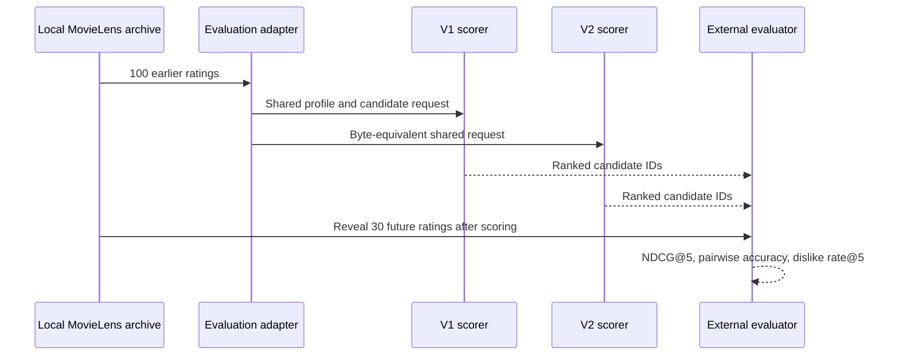

# MovieLens One-User Chronological Tracer Bullet

Date: 2026-07-10.
Phase: Recommendation Learning Lab.
Issue: #121.
Role opened: Exploration only.
Machine-readable summary: `docs/validation/movielens-one-user-trace.json`.
Detailed row trace: Ignored local research storage only.

## Claim

One real MovieLens user can travel through the complete offline evaluation boundary without future-label leakage or scorer input drift.
This is a tracer bullet for evaluation plumbing, not a population-level recommendation-quality claim.

## Contract

The selected user belongs to the deterministic exploration manifest and is represented publicly only by a pseudonym.
The final 100 earlier ratings become WatchSignal `ProfileTasteEvidence` with traceable MovieLens source IDs, normalized preference values, genres, and UTC timestamps.
The following 30 movies become one shared `Candidate` pool with TMDb source IDs.
V1 and V2 receive the same immutable `ScoringRequest` object and the same serialized request fingerprint.

The candidate records contain movie identity and metadata but not the user's future rating.
Only after both scorers return rankings does the evaluator join the 30 future ratings and calculate metrics.

## Evidence

- Profile rows: 100.
- Future rows: 30.
- Candidate rows: 30.
- Missing movie identifiers: 0.
- Neutral labels excluded from positive-versus-negative pairwise comparisons: 15.
- Future labels present in scoring input: false.
- Candidate pool parity: passed.
- Strict temporal boundary: passed.
- V1 and V2 request fingerprint: `7debddbc2a0d86a581647787008e18eef0246b89f6039c4d6d9aa6501f1f2b3c`.

| Scorer | NDCG@5 | Pairwise preference accuracy | Known-dislike rate@5 |
| --- | ---: | ---: | ---: |
| V1 heuristic | 0.494403 | 0.58 | 0.00 |
| V2 contract | 0.494403 | 0.60 | 0.00 |

The equal NDCG@5 and small pairwise difference are not a promotion result.
One user is intentionally too small to support a quality conclusion.
Issue #122 scales this exact contract across the exploration cohort and adds a popularity baseline.

## Failure Proofs

The automated tests deliberately append one future row to the profile and verify that the temporal boundary rejects it.
They deliberately remove a candidate from one scorer request and verify that byte-equivalent input parity rejects it.
They point the tracer at a sealed manifest and verify that issue #121 cannot open those labels.
They run the fixture trace twice and verify identical machine-readable output.

## Production Boundary

The evaluation modules are outside the API and production request paths.
No route, UI, scorer default, persistence behavior, or live recommendation behavior changed.

## Reproduction

Run `pnpm eval:movielens:trace` with the local MovieLens 32M archive and the verified exploration manifest.
The detailed report remains under ignored local storage because it includes MovieLens-derived row identifiers and ratings.
The committed summary contains only a user pseudonym, aggregate counts, fingerprints, metrics, and a checksum of the local trace.
